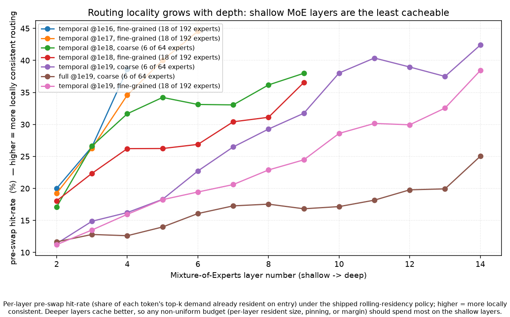
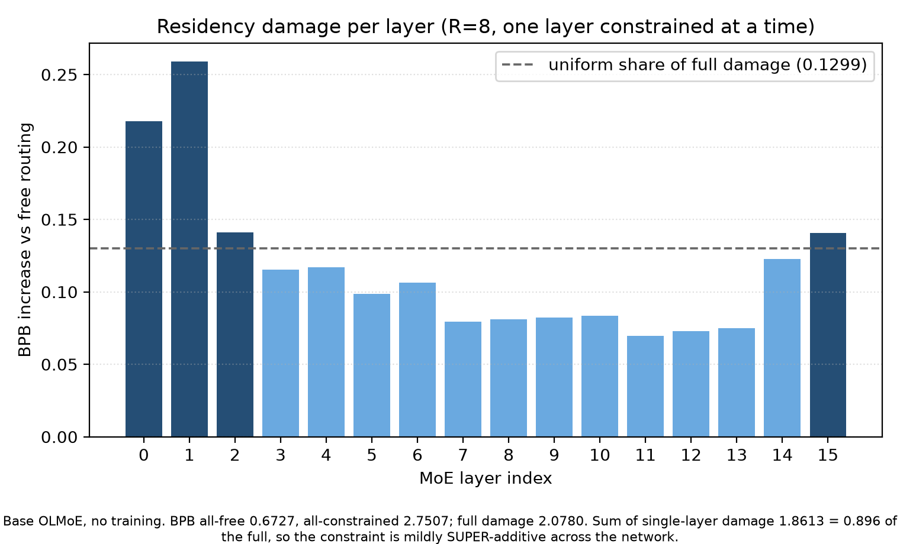

# What rolling residency does to routing, and what it costs

Results only. History is in [`05-notebook.md`](05-notebook.md), the delta against the published
write-up is in [`02-corrections.md`](02-corrections.md), probe construction is in
[`03-methods.md`](03-methods.md), and what exists over which runs is in
[`04-coverage.md`](04-coverage.md).

## 0. Scope, and how to read the numbers

This document covers what the residency constraint does to a router and what it costs. The adaptation
program's own questions, retrofitting the constraint to a pretrained model and the per-layer embedding
work, are written up in [`../../../results/ablations/ple_RESULTS.md`](../../../results/ablations/ple_RESULTS.md).
Its layer-freeing results appear in section 5 because they bear on layer choice.

Two regimes are compared throughout. **Unconstrained** is an ordinary mixture-of-experts model, every
expert available at every token. **Constrained** is the same shape trained under rolling residency.
Floating-point operations are identical in both.

Measurements, each defined once here and used consistently:

- **Token AUC** and **context AUC.** A ridge probe on input embeddings predicts whether a given expert
  fires at a position, from either the current token's embedding or the mean of a surrounding window
  that excludes the current token. Scored on held-out documents. Chance is 0.5. **Context minus token**
  is positive when routing is better predicted by surroundings than by the token itself.
- **Cost.** Test bits per byte with the constraint changed at one layer, minus the same model in its
  native regime. Positive is worse. For a constrained model this means unmasking one layer; for an
  unconstrained model, imposing residency at one layer.
- **Participation ratio.** Inverse Simpson index of an expert's token distribution, normalised to a
  0 to 1 scale. Higher means the expert spreads over more of the stream.
- **Hit rate.** Share of the unconstrained top-k already resident before any swap. The random floor is
  k/E, which is 0.094 at both granularities used here.
- **Retained mass.** Share of the unconstrained top-k routing mass held by the resident set.
- **Demand AUC.** A causal probe using only routing history predicts whether an expert is demanded at
  the next position.
- **The sham.** The constraint replaced by a Gaussian perturbation of the router logits, matched in
  magnitude and carrying no lexical information. It measures how much of an effect is positional
  rather than about token identity.

Some evidence cannot be regenerated. Eight result files have no producer in any commit on any branch,
and the runs behind them kept neither a router log nor a checkpoint. Claims resting on those say so in
the sentence that makes them. The list is in
[`../../../results/ablations/README.md`](../../../results/ablations/README.md).

## 1. What the router does

Routing changes what it keys on. In the unconstrained regime the current token dominates; under the
constraint, surroundings do.

Across 34 trained models the token axis separates the two regimes completely, with an empty band
0.184 wide containing no model of either kind. The context axis does not separate them at all:
several constrained models sit below unconstrained ones. So the constraint does not add context
sensitivity, it removes the token signal.

The interesting half of that table is the token column, not the context column. Context AUC is similar
in both regimes, 0.640 against 0.697, so the constraint does not create context sensitivity that was
absent before. What it does is destroy the token signal, from 0.884 to 0.585.

*Each point is one trained model. Horizontal axis is how well the current token predicts firing,
vertical axis how well the surrounding context does. The two regimes separate on the horizontal
axis, not the vertical one.*

Three checks say the low token number is a fact about routing rather than about the probe.

- The linear probe reaches 99.4% of the nonparametric ceiling from token identity alone in the
  unconstrained regime and 101.8% in the constrained one. There is no token signal left for a better
  probe to find.
- Substituting causally agrees. Holding context fixed and swapping a frequency-matched token, against
  holding the token fixed and swapping context, gives a context-over-token ratio of 0.69 unconstrained
  (range 0.28 to 0.79) and 1.58 constrained (1.25 to 2.18) over 29 measurements each. The ranges do not
  overlap.
- It is not a rare-token effect. Stratifying token AUC by corpus frequency, the unconstrained regime
  runs 0.813 to 0.891 across five strata and the constrained one 0.550 to 0.581. Neither shows the
  signal concentrating in any frequency band.

Two consequences follow at serving time, and they belong here because they describe routing behaviour
rather than a system design.

- Demand becomes predictable from history alone: 0.981 constrained (0.919 to 0.993, n = 103) against
  0.655 unconstrained (0.567 to 0.716, n = 89). This is the largest clean separation in the program and
  the two ranges are nowhere near each other.
- The cache hits far above the 0.094 random floor: 0.317 constrained at coarse granularity and 0.326 at
  fine, against 0.172 unconstrained. 

*Share of the unconstrained top-k already resident, by layer. Higher is better. The dashed line is
the k/E random floor at 0.094. Both regimes sit above it and the constrained one roughly doubles
it.*

### Depth

Context dominance rises with depth, but not equally in the two regimes, and the difference matters.

| regime | arms | median slope per layer | interval excludes zero |
|---|---|---|---|
| unconstrained | 5 | +0.0139 | 4 of 5 |
| constrained | 6 | +0.0018 | 3 of 6 |

Per-arm ordinary least squares on context minus token against layer index, with bootstrap intervals.
Positive means routing grows more contextual deeper in the stack.

The rise is solid in the unconstrained regime and about eight times smaller and inconsistent in the
constrained one. So the gap between regimes **narrows** with depth rather than widening: it is roughly
0.39 at the shallowest layer and 0.27 at the deepest. A constrained router is already contextual at
layer 2 and has little further to move.

*Positive means routing is better predicted by surroundings than by the current token. The
unconstrained curves climb steeply; the constrained ones start high and stay nearly flat, so the
vertical gap closes with depth.*

Pooling layers across arms of different depths hides this, because the eight-layer arms are flat while
the thirteen-layer arms rise. Per-arm slopes are the right statistic.

Finally, the shift is produced by training under the constraint and not by the constraint itself. That
is section 5, and it is the reason this section describes a learned property rather than a mechanical
one.

## 2. What an expert represents

Under the constraint each expert covers more of the stream, and the routing distribution flattens.

| | participation ratio | generalist fraction | router entropy |
|---|---|---|---|
| unconstrained, 14 models | 0.201 to 0.422 | 0.000 to 0.328 | 0.790 to 0.917 |
| constrained, 16 models | 0.292 to 0.801 | 0.036 to 0.914 | 0.886 to 0.974 |
| the zero-layer control (see below) | 0.328 | 0.036 | 0.886 |

Full range across models, median over each model's layers. Higher means flatter, less specialised
routing. Generalist fraction is the participation-ratio column thresholded at 0.5, so it restates
rather than adds.

Unlike the locus result above, these ranges **overlap**, so the flattening is a strong tendency and
not a separator. The third row is a control worth explaining. It comes from the from-scratch training sweep in
section 4, which trains the same model under schedules that constrain different subsets of layers.
One arm in that sweep constrains **no** layers at all. It is built and trained exactly like a
constrained model, counted as one everywhere in the pipeline, and differs only in that the constraint
is never applied. If these statistics measure the constraint rather than something incidental to how
constrained runs are configured, that arm has to land with the unconstrained models. It does, at the
very bottom of the constrained range. Nothing else in this section would have caught a bug that
inflated every constrained model equally.

- Generalist fraction falls with depth in both regimes, so the flattening is strongest early.
The inventory is not starved. Across the shipped configurations, the union of experts touched per
sequence covers 85 to 100% of the pool, and effective experts, the diversity-weighted count the paper
reports, tracks it closely:

| model | budget | regime | experts | union, mean | union, share of E | effective experts |
|---|---|---|---|---|---|---|
| `moe_coarse_1e19` | 1e19 | unconstrained | 64 | 63.8 | 0.997 | 59.8 |
| `g3_tmoe_s2_1e17` | 1e17 | constrained | 192 | 160.8 | 0.837 | 187.8 |
| `flame38m_g1_temporal` | 1e18 | constrained | 64 | 62.0 | 0.969 | 63.1 |
| `flame38m_g3_temporal` | 1e18 | constrained | 192 | 163.4 | 0.851 | 187.2 |
| `g1_tmoe_coarse_1e19` | 1e19 | constrained | 64 | 63.9 | 0.999 | 62.5 |
| `temporal_fine_g3_1e19` | 1e19 | constrained | 192 | 184.2 | 0.959 | 183.0 |

Union is the mean number of distinct experts a sequence touches; effective experts is the same count
weighted by how evenly usage is spread, so it penalises a long tail of barely-used experts. Both are
better when higher if the goal is to use the pool you paid for.

An earlier version of this section quoted a range of 13 to 99.9% here. That pooled these shipped
configurations with sixteen deliberate diversity-suppression screens (`ant0p1`, `bursty`, the `head`
and momentum families) whose whole purpose is to collapse the expert set. The 13% floor is
`ant0p1` behaving as designed, not a property of the method.
- Five different router designs, including auxiliary-loss-free and two momentum variants, land in the
  same structural band, with generalist fractions from 0.578 to 0.698. The effect belongs to the
  constraint and not to any particular router.

*How often each expert is resident, one curve per regime. A flatter, wider distribution means load
spread over more experts. The constrained curve is flatter, which is the same fact the table above
states as participation ratio.*

Two things do not change. Expert weight geometry is indistinguishable between regimes on centroid
distance and pairwise cosine. The output-side result does not replicate: at 1e18 the constrained model
writes sharper output distributions at 4 of 8 layers on the data-weighted metric and 0 of 8 on the
static one, with no consistent direction in the fine-grained pair.

One structural result runs opposite to the intuition that the constraint fragments the router. Comparing
router subspaces across layer pairs, at gaps of four layers or more the unconstrained router is
**more** self-similar than the constrained one, 2.28 times chance against 1.56. The constrained router
differentiates its subspaces across depth more, not less. The statistic is degenerate on 11 of 26 arms
where the expert count meets or exceeds the hidden width, and those arms are excluded.

## 3. Serving

The demand signal is the lever, and the eviction rule is not.

Both are measured by replaying the same recorded routing demand through different serving policies,
so the model never changes and only the cache logic does. The metric is **set coverage**: of the
experts a token actually wants, what share the resident set already holds when the token arrives.
Higher is better, and the floor is k/E, or 9.4% here. The question is how much of the gap between a
naive rule and a perfect one is reachable.

| eviction policy | set coverage |
|---|---|
| discounted oracle, g = 0.5 | 49.5% |
| discounted oracle, g = 0.9 | 45.8% |
| Belady with prefetch, h = 1 | 41.7% |
| Belady, the offline optimum | 33.1% |
| minimum logit, shipped | 26.2% |
| least recently used | 21.8% |

Medians over 66 measurements on the six shipped configurations, excluding the sixteen
diversity-suppression screens, which distort the expert distribution by design. Higher is better.

Belady is the offline optimum for a pure eviction rule, so the gap from the shipped policy up to it
bounds what a smarter eviction rule can win: **6.5 to 9.7 points** across the six configurations.
Everything above that line buys its coverage by seeing future demand, which is a different lever
entirely.

*Set coverage by policy against the offline optimum. Higher is better. The gap from the best
practical policy to the bound is small next to the gap a better demand estimate opens.*

Smoothing that estimate is worth more than any eviction rule:

| smoothing strength | set coverage |
|---|---|
| none | 0.310 |
| 0.5 | 0.463 |
| 0.25 | 0.640 |
| 0.1 | 0.854 |

A factor of 2.8 across the range, on the same measurements.

*Each point is one smoothing strength. Up and to the left is better: more coverage for fewer swaps.*

A better demand signal is not the same as a perfect one. Replacing the estimate with perfect
next-token foresight helps at coarse granularity, by 6.6 to 10.1 points over six runs, and hurts at
fine, by 2.6 to 11.2 points over fourteen. The split is 20 of 20 by granularity.

| granularity | runs | effect of perfect foresight |
|---|---|---|
| k = 6 of 64 experts | 6 | +6.6 to +10.1 points |
| k = 18 of 192 experts | 14 | −2.6 to −11.2 points |

Change in resident-set quality when the demand estimate is replaced by perfect next-token knowledge.
Positive is better. No run in either group crosses zero. The natural reading
is that chasing instantaneous demand destroys accumulated locality, so foresight without a retention
objective is a liability. Two caveats belong with the claim: granularity is confounded with expert
count and model family, since every k = 6 run is a 64-expert model and every k = 18 run a 192-expert
one, and **none of the twenty runs kept a router log, so this cannot be re-measured.**

Other properties of the resident set:

- Mass consistency exceeds set consistency, 0.419 against 0.374 constrained. The experts carrying
  routing weight stay resident while marginal ones churn. The unconstrained comparison rests on the
  single preserved baseline log, 0.186 against 0.168.
- Hysteresis can eliminate swapping entirely and the price is steep. Raising the threshold drives swap
  rate from 1.000 to 0.000 while retained mass falls from 0.353 to 0.114.
- Recomputing residency in blocks instead of rolling it is a tradeoff, not a loss. At a block length of
  72 tokens it holds 28.55 retained mass against rolling's 45.76, but does 0.12 swaps per token against
  rolling's ceiling of 1. Worth considering when swap bandwidth binds rather than routing quality.
  **Producerless and unreplayable.**
- Swap rate is not a useful statistic. It sits at a median of 1.000 across 112 per-layer records, range
  0.987 to 1.000, because at R = k a swap fires whenever any demanded expert is missing. Use the 95th
  percentile burst length instead.
Enlarging the resident cache closes the regime gap:

| cache size, K/k | unconstrained | constrained |
|---|---|---|
| 1 | 0.169 | 0.236 |
| 2 | 0.284 | 0.401 |
| 3 | 0.386 | 0.497 |
| 10.5 | 0.990 | 0.993 |

Hit rate against resident-cache size in multiples of k. Higher is better. The constrained arm leads
throughout and both saturate around ten times k, so the advantage is largest exactly where memory is
scarce.

Locality does not grow with scale:

| active parameters | constrained overlap | random floor |
|---|---|---|
| 1.4M | 28.4% | 9.4% |
| 8.2M | 32.9% | 9.4% |
| 12.2M | 31.2% | 9.4% |
| 184.1M | 28.3% | 9.4% |
| 185.8M | 23.5% | 9.4% |

Share of the expert set shared between neighbouring positions. Higher means more locality to
exploit. It holds near three times the random floor across a 130-fold range of model size rather
than growing, and the one matched unconstrained arm sits at 19.2%.
Document boundaries are not a cold start. Over windows of 4, 16 and 64 tokens after a boundary,
the median hit-rate penalty is 0.9 points and is negative on some models, because routing keys on
a surrounding window rather than on document identity.

## 4. What it costs

Globally the constraint is cheap. Across a 10.7-fold range of resident-set size, test bits per byte
moves from 1.4750 at full constraint to 1.4519 unconstrained, a cost of **0.0231 BPB**.

| resident set, R/k | test BPB |
|---|---|
| 1 | 1.4750 |
| 2 | 1.4736 |
| 4 | 1.4681 |
| 7.1 | 1.4580 |
| 10.7 | 1.4519 |

Lower is better. Most of the 0.0231 arrives in the last doubling, so the curve is flat where it
matters and steep only as the constraint is fully released.

*Test bits per byte against resident-set size. Lower is better. The whole range costs 0.0231.*

At 1e18 the sign reverses and the constrained model wins outright, at both granularities: 1.3124
against 1.3175 coarse and 1.3339 against 1.3478 fine, over three to five seeds per cell with seed
standard deviations of 0.0011 to 0.0020. Both gaps are several standard errors wide, so this is not
noise, and no explanation for it is offered here.

That number describes training with the constraint. Imposing it on a finished model is a different
measurement and roughly twenty times more expensive.

| direction | budget | cost, BPB |
|---|---|---|
| trained with, then unmasked | 1e16 | +0.0994 |
| trained with, then unmasked | 1e17 | +0.1242 |
| trained with, then unmasked | 1e19 | +0.2006, +0.2064 |
| trained without, then imposed | 1e16, 1e17 | +0.2403, +0.6099 |
| trained without, then imposed | 1e19 | +0.4314 |

Positive is worse. Neither regime transfers to the other. The unmasking direction rises across its
three budgets; the imposition direction does not, so no budget trend should be claimed for both. Both
files are producerless, though the 1e19 one is re-runnable from surviving checkpoints.

### By layer

The last layer is consistently the most expensive to change. Across all seven per-layer measurements
it costs between 1.61 and 3.22 times the interior mean. The first layer is elevated in two of the
seven, both unconstrained models at 1e18, and sits at or below the interior mean in three others.

| model | budget | direction | first / interior | last / interior |
|---|---|---|---|---|
| g1 moe | 1e18 | impose | 1.78 | 2.02 |
| g3 moe | 1e18 | impose | 1.97 | 3.00 |
| coarse moe | 1e19 | impose | 1.01 | 1.70 |
| g1 temporal | 1e18 | unmask | 1.18 | 1.61 |
| g1 temporal, seed 2 | 1e18 | unmask | 0.93 | 2.00 |
| g3 temporal | 1e18 | unmask | 0.94 | 1.85 |
| coarse temporal | 1e19 | unmask | 1.17 | 3.22 |

Per-layer cost relative to the mean over interior layers. Higher means more expensive to change at
that layer. The seven measurements also disagree about where the minimum sits, so no vertex is claimed.

*Layers ranked by how local their routing is. The ordering does not match the cost ordering above,
which is the point section 4.3 quantifies.*

The reason is positional, not lexical. A magnitude-matched perturbation carrying no lexical information
reproduces most of the endpoint excess: 63% on the coarse model and 83% on the fine one, where the
excess is the mean of the two endpoint costs minus the mean over interior layers, and the noise scale
is the calibration whose mean cost matches the real one, to 0.2% on the coarse model. 

*Top: per-layer cost of imposing the real constraint against a lexicality-free perturbation of
matched average size. Bottom: the residual. Lower is better throughout. The residual is near zero
across the interior and positive at both ends, so what the sham fails to explain is itself an
endpoint effect.* The lexical reading fails on
its own terms as well: in the three imposition arms the last layer ranks most contextual of all,
8 of 8, 8 of 8 and 13 of 13, which is the opposite of what a token-boundness explanation predicts.

Trained from scratch with individual layers constrained, over three seeds and three MoE layers:

| constrained layers | test CE | against none |
|---|---|---|
| none | 4.0182 | 0 |
| layer 3, the middle | 4.0208 | +0.0026 |
| layer 4 | 4.0335 | +0.0153 |
| layer 2 | 4.0349 | +0.0167 |
| all three | 4.0601 | +0.0419 |

Lower is better, three seeds per row. The middle layer is cheapest and both ends cost more.
Endpoints against middle is +0.0134 CE at 2.4 standard errors. Constraining all three costs +0.0419
at 5.3 standard errors, the only contrast in that sweep comfortably resolved.

### Which profile the cost follows

Per-layer cost tracks how stable a layer's demand is, and not how lexical it is.

| cost against | Spearman |
|---|---|
| churn | −0.91 |
| demand forecastability | +0.78 |
| cache hit rate | +0.75 |
| generalist fraction | −0.69 |
| contextual share | +0.19 |

Thirteen layers of one model. Sign convention: cost is higher where churn is lower.

The first three rows are one factor, not three. Churn, hit rate and demand AUC intercorrelate between
0.87 and 0.97, so they measure demand stability three ways. Against that, contextual share at +0.19 is
close to nothing. The layers that lose most when the constraint changes are the ones whose demand was
most predictable, not the ones closest to the token. This is the leading hypothesis rather than a
result: one model, thirteen points.

## 5. Adapting a pretrained model

Everything above is measured on models trained under the constraint from the start. Retrofitting it to
a pretrained 16-layer model separates what the constraint does from what training under it does, and
the two are not the same.

Running the same locus probe on an adapted OLMoE:

| condition | context minus token |
|---|---|
| base model, constraint imposed, no training | −0.0041 |
| adapted on cross-entropy | +0.0493 |
| adapted with per-layer embeddings | +0.093 to +0.096 |

Impose the constraint and there is no contextual shift at all. Train under it and the shift appears,
and grows with more adaptation. Section 1 describes something the model learns, not something the
constraint imposes.

The same asymmetry undoes the obvious way to choose which layers to free. Single-layer damage on this
model is U-shaped, worst at layer 1 and lowest at layer 11, with both ends elevated.

*Cost of constraining each layer alone, all sixteen. Lower is better. The shape is the reason
freeing the ends looks attractive, and the tables below are why it cannot be read off this curve.*
Layers 2 and 15
tie on it almost exactly, 0.1408 against 0.1408. Freeing them is not equivalent:

| free set | resident memory | BPB | mean downstream accuracy |
|---|---|---|---|
| {0,1} | +87.5% | 0.814440 | 0.5937 |
| {0,1,2} | +131.2% | 0.808615 | 0.5937 |
| {0,1,15} | +131.2% | 0.797810 | 0.6030 |
| {0,1,14,15} | +175.0% | 0.786275 | 0.6037 |

Lower BPB and higher accuracy are better. The middle two rows cost identical memory and differ only in
which layer is freed third.

The training-free profile predicted layer 2 would be worth 5.8 times layer 15 as the third freed layer.
Trained, layer 15 wins by 0.0108 BPB and takes the better downstream score. Two further cells
contradict the profile the same way, one of them a controlled matched-memory pair. **Do not choose free
sets from single-layer damage.** Freeing both ends is the best configuration in that program, and
training-free it looked dominated.

## 6. What to do with it

- Exempt the first and last MoE layers if you exempt any, on the architectural grounds in section 4,
  not on lexicality. The last layer is among the least token-bound in the stack.
- Do not pick free sets from single-layer ablation. It is wrong on this model in three cells.
- Do not invest in a better demand oracle. A perfect one is worse at fine granularity.
- Spend effort on smoothing the demand estimate, worth 2.8 times, before eviction policy, worth 2.

## 7. How much of this to believe

- Every locus and lens measurement is one training seed per cell.
- Only one unconstrained run has a preserved router log, so every regime contrast in section 3, and the
  inventory and consistency comparisons in sections 2 and 3, rest on a single baseline.
- No per-layer measurement above 13 layers on models we trained. The 16-layer evidence is section 5's
  and comes from a different program on a model we did not train.
- Eight files cannot be regenerated. Section 3's oracle result rests entirely on two of them and its
  block-wise result on a third, and section 4's cross-regime table on two more.
- Two structural files were measured by a method since superseded but remain the only record of eight
  runs whose checkpoints no longer exist. Section 2's numbers come from the per-layer replacements.
- Four analyses were read and produced nothing load-bearing: momentum smoothing moves set coverage by
  one point across its whole range, anomaly prediction splits by regime exactly as demand
  forecastability does, and a centre-of-mass replay covers two runs of one router variant.

## 8. What is worth doing next

- Does demand forecastability predict which layers are worth *freeing*, or only what constraining one
  *costs*? Section 4 correlates it with solo cost; section 5 shows solo measurements misrank layers for
  set selection. No single model currently carries both measurements, so the question is open by
  construction.
- The 1e19 cross-regime cells are re-runnable and would give the imposition direction a third budget.
- The sham percentages need their producer's definition pinned down before they are quoted again.
