# What rolling residency does to routing, and what it costs

> **Status (2026-08-19).** The 2026-08-14 deprecation banner is resolved: the
> instruct-era sections (5 onward) were re-verified against the corrected
> protocol and updated in place with the 2026-08-16/19 results (the adaptation
> program, the thinking/length re-measurement, and the WritingBench fluency
> matrix). Probe-era sections 1 to 4 stand as written with the caveats of
> section 7; their superseded predecessors remain in `archive/`.

Results only. History is in [`05-notebook.md`](05-notebook.md), the delta against the published
write-up is in [`02-corrections.md`](02-corrections.md), probe construction is in
[`03-methods.md`](03-methods.md), and what exists over which runs is in
[`04-coverage.md`](04-coverage.md).

## 0. Scope, and how to read the numbers

**Two regimes throughout.** *Full MoE* is an ordinary mixture-of-experts model, every expert
available at every token. *Temporal* is the same shape trained under rolling residency. Identical
floating-point operations, and the names match the `regime` column in every CSV and the legends on
every figure here.

**Retrofitting the constraint to a pretrained model is section 5.** The per-layer embedding work is
dead under the correct convention (section 5);
[`ple_RESULTS.md`](../../../results/ablations/ple_RESULTS.md) is its era record.

**Cost**, used throughout: test bits per byte with the constraint changed at one layer, minus the
model in its native regime. Positive is worse. Unmasking a layer for a temporal model, imposing
residency for a full MoE one. Everything else is defined where it is used.

**Eight files cannot be regenerated.** No producer in any commit on any branch, and their runs kept
neither a router log nor a checkpoint. Claims resting on them say so in the sentence that makes them.
List in [`results/ablations/README.md`](../../../results/ablations/README.md).

## 1. What the router does

A ridge probe asks "does expert *e* fire here?", given either the current token's embedding
(**token AUC**) or the surrounding window with that token excluded (**context AUC**). Held out on
unseen documents, chance 0.5. Their difference, **context minus token**, is positive when surroundings
predict routing better than the token does.

**The constraint destroys the token signal rather than adding a context signal.** Across 34 trained
models the token axis separates the regimes completely, with an empty band 0.184 wide. The context
axis does not separate them at all: several temporal models sit *below* full MoE ones.

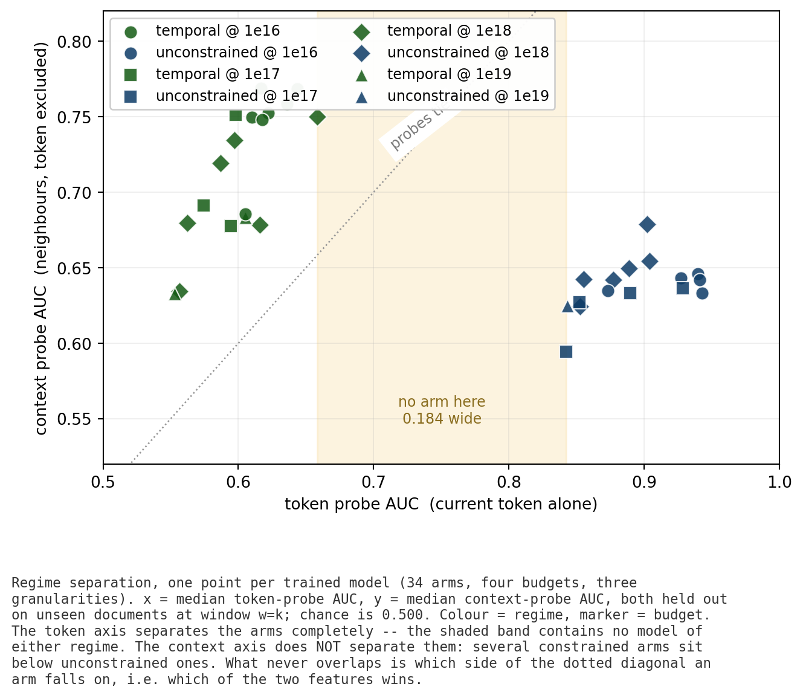

*One point per trained model, lines joining a granularity across budgets. Horizontal: how well the
current token predicts firing. Vertical: how well the surrounding context does. Separation is
horizontal only.*

Three checks that this is routing and not a weak probe:

- **No token signal is left to find.** The linear probe reaches 99.4% of the nonparametric ceiling
  from token identity alone in the full MoE regime, and 101.8% in the temporal one.
- **Causal, not correlational.** Swapping a frequency-matched token with context held fixed, against
  the reverse: context-over-token ratio 0.69 full MoE (0.28 to 0.79) against 1.58 temporal (1.25 to 2.18), 29 measurements each, ranges non-overlapping.
- **Not a rare-token artifact.** Token AUC by corpus-frequency stratum runs 0.813 to 0.891 full MoE
  and 0.550 to 0.581 temporal. No band concentrates the signal.

Two consequences, here rather than in section 3 because they describe the router:

- **Demand becomes predictable from history alone.** A causal probe given only routing history
  predicts the next position's demand: 0.981 temporal (0.919 to 0.993, n = 103)
  against 0.655 full MoE (0.567 to 0.716, n = 89). Largest clean separation in the program, with
  daylight between the ranges.
- **The cache hits far above chance.** **Hit rate** is the share of the unconstrained top-k already
  resident before any swap, on a k/E floor of 0.094. It reaches 0.317 temporal coarse and 0.326
  fine, against 0.172 full MoE.

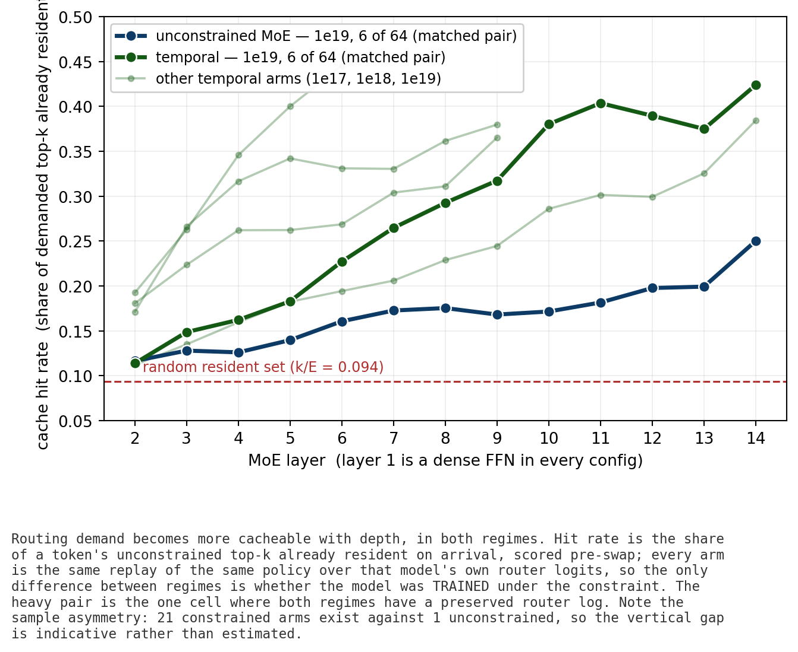

*Hit rate by layer, both regimes, against the k/E floor. Higher is better. Deeper layers cache
better, so a non-uniform memory budget should favour shallow ones.*

### Depth

**Routing grows more contextual with depth, but far more so in the full MoE regime.** Per-arm slopes of
context minus token against layer index, bootstrap intervals:

| regime | arms | median slope per layer | interval excludes zero |
|---|---|---|---|
| full MoE | 5 | +0.0139 | 4 of 5 |
| temporal | 6 | +0.0018 | 3 of 6 |

- **The gap narrows with depth**, roughly 0.39 at the shallowest layer down to 0.27 at the deepest.
  A temporal router is already contextual at layer 2 and has little further to move.
- **Use per-arm slopes, not pooled layers.** Pooling hides it, because the eight-layer arms are flat
  while the thirteen-layer arms rise.
- **Imposed on a pretrained lexical router, the shift is mechanical**: +0.24 without any training,
  section 5. Whether the trained-from-scratch gap is additionally learned is open; no phase-0
  impose-locus measurement exists.

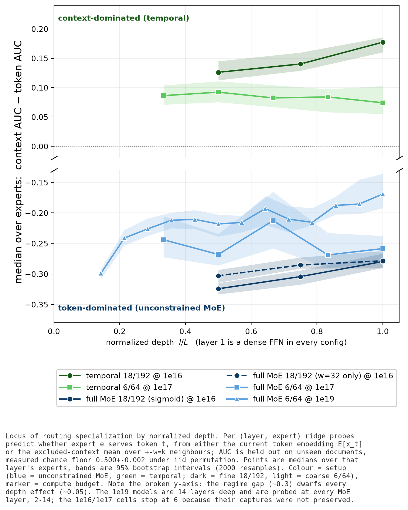

*Broken y-axis: the regime gap of about 0.3 dwarfs the depth effect of about 0.05. Full MoE
curves climb; temporal curves start high and stay flat.*

## 2. What an expert represents

**Each expert covers more of the stream, and routing flattens.** **Participation ratio** is the
inverse Simpson index of an expert's token distribution on a 0 to 1 scale, higher meaning it spreads
further; **generalist fraction** is the share above 0.5, a threshold on the first rather than separate
evidence. Full range across models, median over each model's layers.

| | participation ratio | generalist fraction | router entropy |
|---|---|---|---|
| full MoE, 14 models | 0.201 to 0.422 | 0.000 to 0.328 | 0.790 to 0.917 |
| temporal, 16 models | 0.292 to 0.801 | 0.036 to 0.914 | 0.886 to 0.974 |
| zero-layer control | 0.328 | 0.036 | 0.886 |

- **These ranges overlap**, unlike the locus result. A strong tendency, not a separator.
- **Flattening is strongest early**: generalist fraction falls with depth in both regimes.
- **The third row is not a control.** It is the temporal trainer run with R = E on every layer,
  which the router makes the unconstrained top-k exactly (the identity the router tests check), so
  it is the baseline trained a second time through the temporal code path. It lands with the full
  MoE models because it is one. The paper does not cite it; do not reintroduce it as evidence that
  the spread "tracks the constraint rather than the training configuration", since the two
  regimes differ only by the constraint by construction.
- **Union** is the mean count of distinct experts a sequence touches. **Effective experts** weights
  that count by how evenly usage is spread, penalising a long tail of barely-used ones. Higher is
  better on both if the goal is to use the pool you paid for.
- **Not a property of one router.** Five designs, including auxiliary-loss-free and two momentum
  variants, land in the same band, generalist fractions 0.578 to 0.698.
- **An earlier draft said 13 to 99.9% here.** That pooled these six shipped configurations with
  sixteen diversity-suppression screens whose purpose is to collapse the expert set. The 13% floor was
  `ant0p1` behaving as designed.

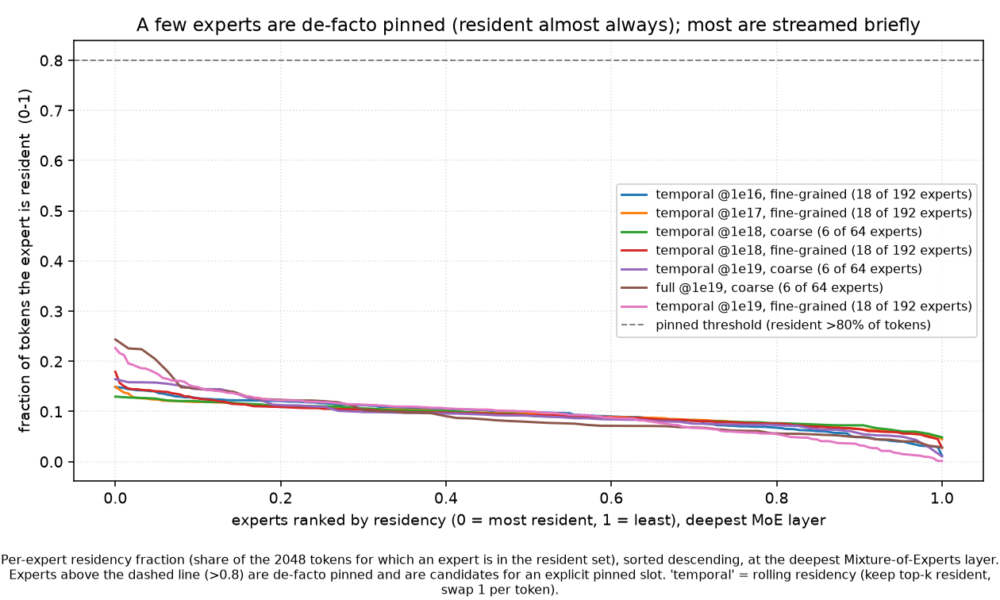

*How often each expert is resident, one curve per regime. Flatter and wider means load spread further.
The same fact the participation-ratio table states numerically.*

What does not change, and one thing that moves the wrong way:

- **Weight geometry is untouched.** Centroid distance and pairwise cosine are indistinguishable
  between regimes.

**Expert weights come out closer to Gaussian.** Excess kurtosis of the weight matrices, where 0 is
Gaussian and higher means heavier tails, so more outliers:

| matched pair | full MoE | temporal |
|---|---|---|
| coarse @1e18, median | 0.42 | **0.14** |
| fine @1e18, median | 0.62 | **0.24** |
| coarse @1e19, median | 0.10 | **0.07** |
| fine @1e18, 99th percentile | 2.79 | **0.77** |

Lower is better if you intend to quantize. The gap is wider in the tail than at the median, which is
where quantization error is decided.

**And that shows up as quantization robustness.** Test bits per byte under fake quantization, lower
is better:

| model | 16-bit | 8-bit | 4-bit | 3-bit | 16 to 3 |
|---|---|---|---|---|---|
| coarse full MoE @1e18 | 1.3158 | 1.3158 | 1.3218 | 1.3520 | +0.0362 |
| coarse temporal @1e18 | 1.3128 | 1.3128 | 1.3176 | 1.3419 | **+0.0291** |
| fine full MoE @1e18 | 1.3462 | 1.3463 | 1.3505 | 1.3705 | +0.0243 |
| fine temporal @1e18 | 1.3354 | 1.3354 | 1.3390 | 1.3562 | **+0.0208** |
| coarse full MoE @1e19 | 1.0510 | 1.0510 | 1.0536 | 1.0662 | +0.0152 |
| coarse temporal @1e19 | 1.0675 | 1.0675 | 1.0697 | 1.0803 | **+0.0128** |

- **Nothing moves at 8 bits** in either regime.
- **The temporal model degrades less in all three matched pairs**, which is the kurtosis result
  cashed out: fewer weight outliers, less quantization error.
- **The two memory levers do not fight.** Rolling residency and low precision compose, which matters
  because they are the obvious things to reach for together.
- One open flag: gradient norms match on median across regimes, but `temporal_coarse_1e19` records a
  maximum of 12.47 against the full MoE 2.52. A single transient or a real interaction, unexamined
  either way.
- **The output side does not replicate.** At 1e18 the temporal model writes sharper distributions
  at 4 of 8 layers on the data-weighted metric, 0 of 8 on the static one, no consistent direction in
  the fine-grained pair.
- **The router does not fragment; it differentiates.** At layer gaps of four or more the
  *full MoE* router is more self-similar, 2.28 times chance against 1.56. Opposite to the
  intuition. Degenerate on 11 of 26 arms where expert count meets or exceeds hidden width, excluded.

## 3. Serving

**The demand signal is the lever. The eviction rule is not.** Both measured by replaying the same
recorded demand through different policies, so only the cache logic varies. Metric is **set
coverage**: of the experts a token wants, the share the resident set already holds when it arrives.
Floor 9.4%.

Two rows below are bounds, not deployable rules. Both need the future, so neither is available at
serving time.

- **Belady.** Evict `argmax_e next(e)`, where `next(e)` is the position of expert *e*'s next demand.
  Optimal for any pure eviction rule.
- **Discounted oracle.** Evict `argmin_e s(e)` where `s(e) = Σ_{i>0} g^i · d_e(t+i)`, and `d_e` is 1
  when *e* is demanded. Small *g* weights the next token or two; `g = 0.95` reaches roughly 20 ahead.

| eviction policy | set coverage |
|---|---|
| discounted oracle, g = 0.5 | 49.5% |
| discounted oracle, g = 0.9 | 45.8% |
| Belady with prefetch, h = 1 | 41.7% |
| Belady, the offline optimum | 33.1% |
| minimum logit, shipped | 26.2% |
| least recently used | 21.8% |

- **Eviction headroom is 6.5 to 9.7 points**, the gap from the shipped rule up to Belady, which is the
  offline optimum for a pure eviction rule. Medians over 66 measurements, six shipped configurations.
- **Rows above Belady are not eviction rules.** They buy coverage by seeing future demand, a different
  lever.
- **Smoothing the demand estimate is worth 2.8x**, 0.310 to 0.854. Bigger than every eviction rule
  combined, and detailed below.

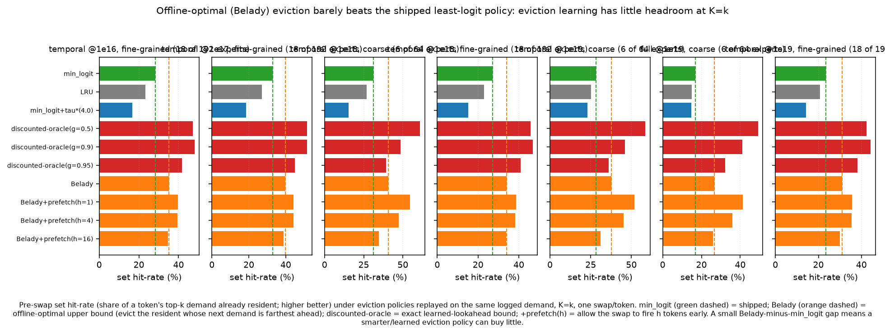

*Set coverage by policy, per shipped configuration. Higher is better. The practical-to-optimal gap is
small next to what a better demand estimate opens.*

- **Smoothing** replaces the per-token demand `d_t` with `d̂_t = β·d_t + (1−β)·d̂_{t−1}`, so one odd
  token cannot evict an expert the stream still wants.
  - `β = 1` is no smoothing; `β = 0.1` averages over roughly the last 10 tokens.
  - Cuts swaps and raises coverage at once, which no eviction rule here manages.

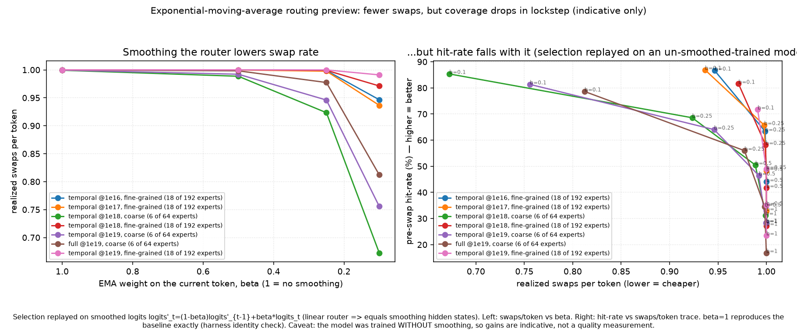

*One point per smoothing strength. Up and to the left is better: more coverage for fewer swaps.*

**A perfect demand signal is worse than a good one, at fine granularity.** Replacing the estimate with
perfect next-token foresight:

| granularity | runs | effect of perfect foresight |
|---|---|---|
| k = 6 of 64 experts | 6 | +6.6 to +10.1 points |
| k = 18 of 192 experts | 14 | −2.6 to −11.2 points |

- **Splits 20 of 20** by granularity, no run crossing zero.
- **Likely cause**: chasing instantaneous demand destroys accumulated locality, so foresight without a
  retention objective is a liability.
- **Confounded.** Every k=6 run is a 64-expert model, every k=18 run a 192-expert one.
- **Unrepeatable.** None of the twenty runs kept a router log.

The resident set, briefly:

- **Mass beats set.** Mass consistency 0.419 against set consistency 0.374: the experts carrying
  routing weight stay put while marginal ones churn.
- **Hysteresis is not free.** Raising the threshold drives swap rate 1.000 to 0.000, but **retained
  mass**, the share of top-k routing *weight* the resident set holds, falls 0.353 to 0.114.
- **Swap rate is a dead statistic**, median 1.000 across 112 records, because at R = k a swap fires
  whenever any demanded expert is missing. Use 95th-percentile burst length.
- **Block-wise residency is a trade, not a loss.** At block length 72 it holds 28.55 retained mass
  against rolling's 45.76, at 0.12 swaps per token against rolling's ceiling of 1. Worth it if swap
  bandwidth binds. Producerless and unreplayable.

**A bigger cache closes the regime gap**, and the temporal arm leads throughout:

| cache size, K/k | full MoE | temporal |
|---|---|---|
| 1 | 0.169 | 0.236 |
| 2 | 0.284 | 0.401 |
| 3 | 0.386 | 0.497 |
| 10.5 | 0.990 | 0.993 |

Both saturate near ten times k, so the advantage is largest exactly where memory is scarce.

**Locality does not grow with scale.** Expert-set overlap between neighbouring positions, against a
9.4% random floor:

| active parameters | 1.4M | 8.2M | 12.2M | 184.1M | 185.8M |
|---|---|---|---|---|---|
| temporal overlap | 28.4% | 32.9% | 31.2% | 28.3% | 23.5% |

Near three times the floor across a 130-fold size range rather than growing. The one matched
full MoE arm sits at 19.2%.

Document boundaries are not a cold start. Over windows of 4, 16 and 64 tokens after a boundary, the
median hit-rate penalty is 0.9 points and is negative on some models, because routing keys on a
surrounding window rather than on document identity.

## 4. What it costs

**Globally, 0.0231 BPB across a 10.7-fold range of resident-set size.** Lower is better:

| resident set, R/k | 1 | 2 | 4 | 7.1 | 10.7 |
|---|---|---|---|---|---|
| test BPB | 1.4750 | 1.4736 | 1.4681 | 1.4580 | 1.4519 |

- **The curve is flat where it matters**, steep only as the constraint is fully released. Most of the
  0.0231 arrives in the last doubling.
- **At 1e18 the temporal model wins outright**, both granularities: 1.3124 against 1.3175 coarse,
  1.3339 against 1.3478 fine, three to five seeds, seed deviations 0.0011 to 0.0020. Several standard
  errors wide, so not noise. No explanation offered.

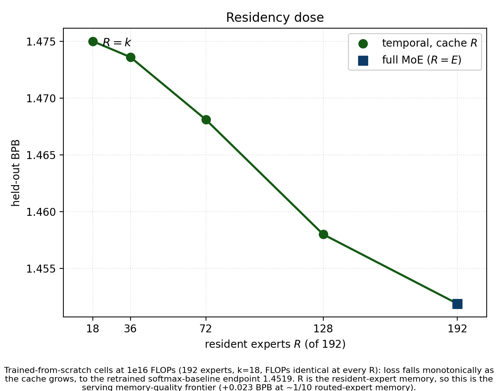

*Test bits per byte against resident-set size. Lower is better.*

**Training with the constraint and imposing it later are different costs, about twenty-fold apart.**

| direction | budget | cost, BPB |
|---|---|---|
| trained with, then unmasked | 1e16 | +0.0994 |
| trained with, then unmasked | 1e17 | +0.1242 |
| trained with, then unmasked | 1e19 | +0.2006, +0.2064 |
| trained without, then imposed | 1e16, 1e17 | +0.2403, +0.6099 |
| trained without, then imposed | 1e19 | +0.4314 |

- **Neither regime transfers.** Positive is worse in both directions.
- **Only the unmasking direction rises with budget.** Imposition does not, so claim no trend for both.
- Both files producerless; the 1e19 one is re-runnable from surviving checkpoints.

### By layer

**The last layer is the most expensive to change, in seven of seven measurements**, at 1.61 to 3.22
times the interior mean. The first is elevated in two, both full MoE models at 1e18.

| model | budget | direction | first / interior | last / interior |
|---|---|---|---|---|
| g1 moe | 1e18 | impose | 1.78 | 2.02 |
| g3 moe | 1e18 | impose | 1.97 | 3.00 |
| coarse moe | 1e19 | impose | 1.01 | 1.70 |
| g1 temporal | 1e18 | unmask | 1.18 | 1.61 |
| g1 temporal, seed 2 | 1e18 | unmask | 0.93 | 2.00 |
| g3 temporal | 1e18 | unmask | 0.94 | 1.85 |
| coarse temporal | 1e19 | unmask | 1.17 | 3.22 |

- **No vertex claimed.** The seven disagree about where the minimum sits.
- **The cause is positional, not lexical.** The **sham** swaps the constraint for a Gaussian
  perturbation of the router logits, matched in average magnitude and carrying no lexical information.
  It reproduces 63% of the endpoint excess on the coarse model and 83% on the fine one. Excess is the
  endpoint mean minus the interior mean; the noise scale is the calibration matching the real mean
  cost, to 0.2% coarse.
- **The lexical reading fails on its own terms.** In the three imposition arms the last layer ranks
  *most* contextual of all, 8 of 8, 8 of 8 and 13 of 13. The opposite of what token-boundness predicts.

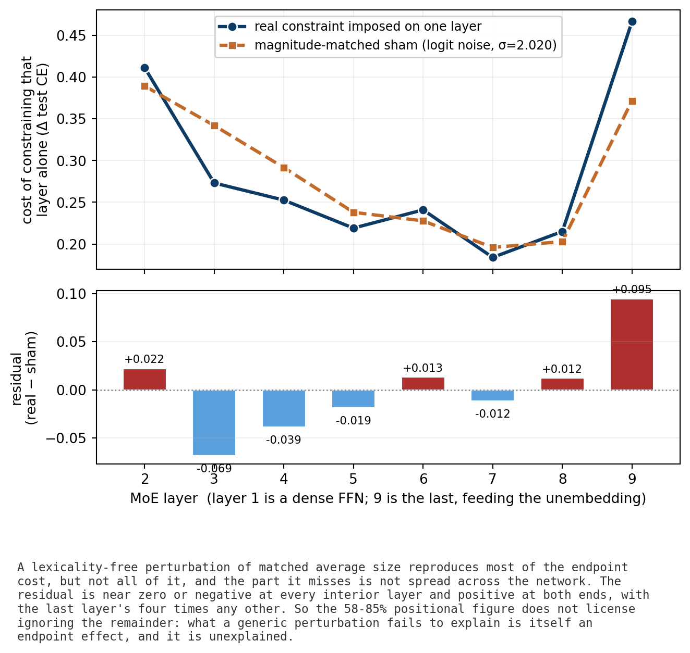

*Top: real constraint against the sham. Bottom: the residual, near zero across the interior and
positive at both ends. What the sham fails to explain is itself an endpoint effect.*

**Trained from scratch, the middle layer is cheapest and both ends cost more.** Three seeds, three
MoE layers, lower is better:

| constrained layers | test CE | against none |
|---|---|---|
| none | 4.0182 | 0 |
| layer 3, the middle | 4.0208 | +0.0026 |
| layer 4 | 4.0335 | +0.0153 |
| layer 2 | 4.0349 | +0.0167 |
| all three | 4.0601 | +0.0419 |

Endpoints against middle is +0.0134 CE at 2.4 standard errors. All three costs +0.0419 at 5.3, the
only contrast in the sweep comfortably resolved.

### Which profile the cost follows

**Cost tracks how stable a layer's demand is, not how lexical it is.** Thirteen layers, one model:

| cost against | churn | demand forecastability | cache hit rate | generalist fraction | contextual share |
|---|---|---|---|---|---|
| Spearman | −0.91 | +0.78 | +0.75 | −0.69 | **+0.19** |

- **The first three are one factor, not three.** Churn, hit rate and demand AUC intercorrelate 0.87
  to 0.97. They measure demand stability three ways.
- **Lexicality is the odd one out** at +0.19, close to nothing.
- **Reading**: the layers that lose most are the ones whose demand was most predictable, not the ones
  closest to the token. Leading hypothesis, not a result. One model, thirteen points.

## 5. Adapting a pretrained model

Everything above is measured on models trained under the constraint from the start. Retrofitting it to
a pretrained 16-layer model separates what the constraint *does* from what training under it does.
Every number here is gate_mass=preserve; the renorm-era measurements this section replaces are era
records in `results/archive/olmoe_wrong_renorm/` and narrated in [`02-corrections.md`](02-corrections.md) §6.

**Imposing the constraint contextualises routing by itself; adaptation adds almost nothing.** Same
locus probe, OLMoE (`ple_locus.csv`):

| condition | context minus token |
|---|---|
| base model, free routing | −0.1445 |
| constraint imposed, no training | +0.1001 |
| adapted, distillation at 100M tokens | +0.1032 |

- **The base router is the most lexical in the program**, token AUC 0.837, and masking to the resident
  set forces selection off the token axis mechanically. The same imposition shift appears on
  Qwen3.5-35B: −0.0002 free to +0.1265 imposed (`locus_qwen.csv`).
- **Per-layer embeddings are dead under the correct convention** on stronger grounds than any probe:
  15M-token arms land at 0.8104 zero-init and 0.8061 calibrated against 0.7887 for LoRA
  (`olmoe_freeset_trained.csv`). The era's other adaptation nulls are records only; none was re-run.

**Single-layer damage rises with depth; the last layer costs 3.3 times the interior mean.**
Layer 15 +0.0223, layer 14 +0.0114, interior mean +0.0067, layer 1 +0.0059
(`olmoe_gatemass_remeasure.csv`).

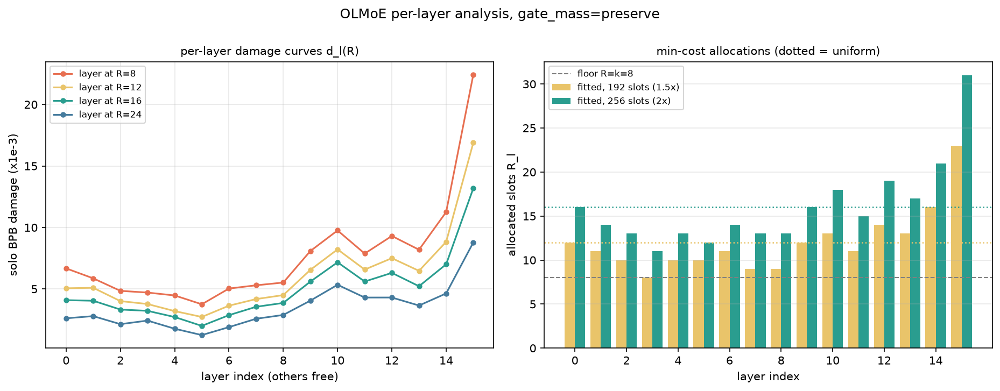

*Left: cost of constraining each layer alone at four residency levels; the profile is monotone in
depth. Right: the greedy allocation it implies against uniform. Lower is better.*

**Solo damage picks the right layers to free.** Joint free sets at matched resident memory, four of
sixteen layers freed, training-free (`olmoe_freeset_joint.csv`, blocked spread ±0.016):

| free set | joint damage, BPB |
|---|---|
| top four by solo damage {10,12,14,15} | **+0.0936** |
| tail {12,13,14,15} | +0.1019 |
| {0,1,14,15} | +0.1092 |
| head {0,1,2,3} | +0.1418 |

- **Trained, the profile's picks give the best adapted cell in the program**: distillation with
  {14,15} free reaches 0.7600 BPB against 0.7887 all-constrained, and 0.6119 mean downstream against
  0.5978 (`olmoe_freeset_trained.csv`).
- **Trained controlled pair, matched memory**: {0,1,15} reaches 0.7602 BPB and 0.6103 mean
  downstream against 0.7734 and 0.6042 for {0,1,2} (`layer_freeing_downstream.csv`, distill 15M,
  at-10M downstream). The profile's deep pick wins on both axes.

**Pick free sets from single-layer damage measured under the model's own gate convention.**

### What adaptation buys, and what imposition costs

**Imposition is mild, not catastrophic.** Ten-task zero-shot, correct convention
(`olmoe_downstream_ref.csv`):

| task | free routing | imposed, no adaptation | adapted (distill) |
|---|---|---|---|
| lambada | 0.7056 | 0.4460 | 0.5791 |
| arc easy | 0.7698 | 0.6364 | 0.6713 |
| hellaswag | 0.5847 | 0.4864 | 0.4859 |
| sciq | 0.9380 | 0.9150 | 0.9270 |
| winogrande | 0.6938 | 0.5691 | 0.5991 |

- **Adaptation recovers 0.30 of the BPB gap and 0.27 of downstream** (distill, 15M tokens: 0.7887
  BPB, mean 0.6017 against free 0.6820 and imposed 0.5723, `layer_freeing_downstream.csv`); the
  {14,15} free variant reaches 0.36 (0.6119, `olmoe_freeset_trained.csv`).
- **The strategy bake-off is an era record.** Router-only floors, the norms-against-LoRA tie, the
  anneal and self-distillation nulls, and the LoRA rank sweep have no correct-convention re-run;
  nothing from that table is quotable.

**The adaptation campaign: LR sweeps to distillation to 100M tokens, against dense floors.**
Three models, 15M-token LR brackets, then the winning recipe at 100M; free-trained nulls land
within 2e-3 of base, so recovery measures the constraint, not corpus drift (records:
`results/ablations/sweep_RESULTS.md` tables 1–2 and the 100M campaign table):

| model at R=k | adapted BPB / downstream, 100M | dense floor | verdict |
|---|---|---|---|
| Qwen3-30B | 0.6676 / 0.6926 | Qwen3-4B: 0.6781 / 0.6852 | **beats its dense floor, both axes** |
| Qwen3.5-35B | 0.6628 / 0.7144 | Qwen3.5-4B: 0.6892 / 0.7028 | **beats it with margin** |
| OLMoE | 0.7779 / 0.6079 | OLMo-1B: — / 0.6006 | edges the 1B bar on downstream |

- **LR optima are model-specific and low**: 3e-5 / 1e-4 / 3e-5, all under the inherited defaults;
  the wrong LR costs more than every recipe refinement combined.
- **Distillation from the own-base teacher beats plain CE** and is the campaign recipe; the token
  axis saturates by 20–40M, so 15M buys most of what 100M does.
- **A constrained MoE can be worth serving over the dense model it outmatches in memory**: both
  Qwen models clear their 4B floors under the constraint; OLMoE at 64 experts does not clear
  its own class.

### Across models

**The damage law is shared.** Within-model degradation follows C·(k/R)^0.81, fixed-effects R² 0.91
over 22 rungs on five models; with the two downstream-only models, seven models from five labs; at
fixed memory fraction, sparser models pay less
(`granularity_ladder.csv`, `frontier_qwen3.csv`, `frontier_qwen3_5.csv`; program record
`results/ablations/sweep_RESULTS.md`).

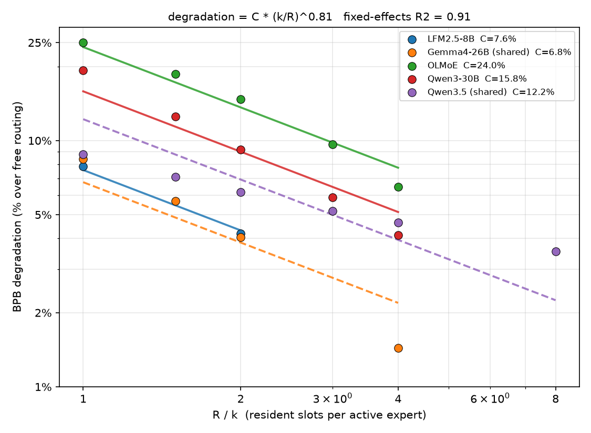

*Percent BPB degradation against residency over active experts, one line per model. Lower is better.*

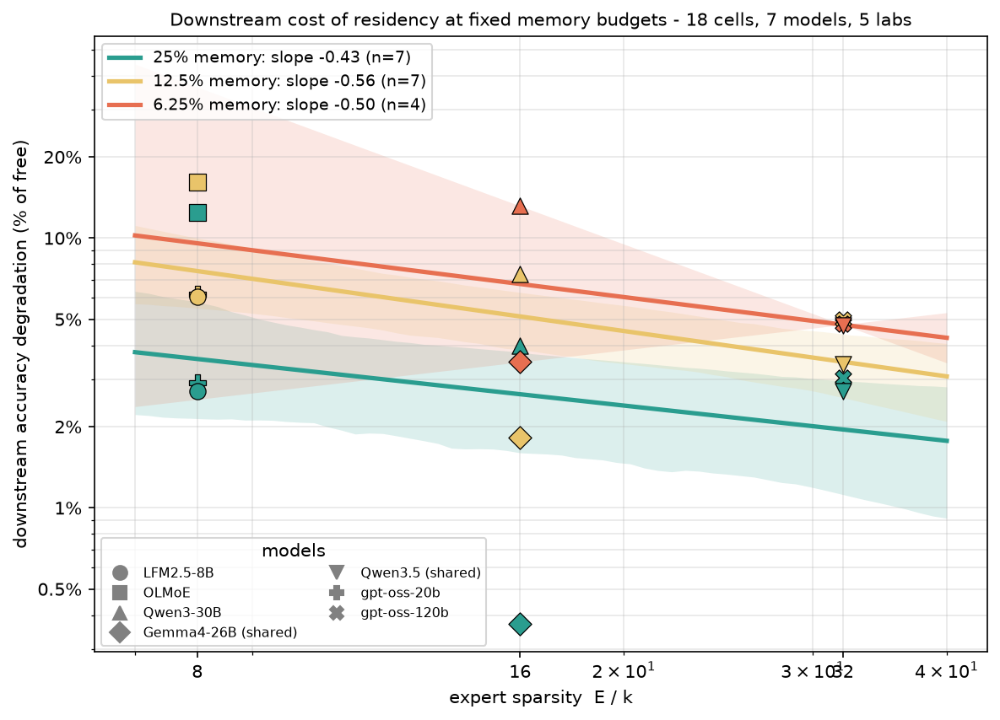

*The same law in downstream accuracy, 18 cells over 7 models, bootstrap 68% bands.*

**Allocation gain tracks how peaked the damage profile is.** All-layers damage at R=k, and fitted
allocation against uniform at iso-memory, negative favours fitted (`perlayer_qwen3.csv`, `perlayer_qwen3_5.csv`,
`perlayer_gemma4.csv`, `frontier_olmoe.csv`):

| model | R=k damage, BPB | fitted − uniform |
|---|---|---|
| Qwen3-30B, 48 layers | +0.118 | **−0.023** |
| OLMoE, 16 | +0.169 | −0.005 |
| Qwen3.5-35B, 40 | +0.055 | −0.004 |
| gemma4-26B, 30 | +0.054 | +0.002, flat profile, allocation loses |

**Instruct checkpoints obey the same ordering, in generation.** Self-CE is each model's
cross-entropy on its own frozen responses to 500 fixed prompts, prefill free, rule enforced on
generated tokens (`instruct_selfce.csv`). Benchmarks run the serving protocol end to end under
each model's own card sampling recipe, thinking judged answer-only, budgets sized to the mode
(the live CSV holds authoritative rows only — one per cell, single protocol era; history and
ledger: `results/ablations/PROTOCOL_ERAS.md`, `superseded/`; ladder-era understatement record:
`results/ablations/reroll_delta_record.md`; free arms audited against published numbers:
`results/ablations/parity_audit.md`; think-in-text models score
channel-native HumanEval, `humaneval_think`/`humaneval_gemma.py`/`humaneval_gptoss.py`):

| model, R = 12.5% of E | self-CE, free → R | gsm8k | ifeval | humaneval | mmlu |
|---|---|---|---|---|---|
| OLMoE-Instruct | 0.354 → 1.297 | 0.70 → 0.47 | 0.59 → 0.52 | 0.37 → 0.27 | 0.50 → 0.29 |
| LFM2.5-A1B | 0.396 → 0.704 | 0.85 → 0.77 | 0.88 → 0.86 | 0.83 → 0.67 | at floor |
| Qwen3.5-35B (thinking) | 0.228 → 0.341 | 0.84 → 0.83 | 0.86 → 0.82 | 0.96 → 0.88 | 0.83 → 0.84 |
| gemma4-26B-IT | 0.139 → 0.350 | 0.86 → 0.86 | 0.86 → 0.87 | 0.99 → 0.97 | 0.61 → 0.72 |

- **MMLU correction (2026-08-16)**: the mmlu column above uses the stock strict
  "The answer is (X)" filter, which measures few-shot format imitation, not
  knowledge — gemma's 0.61 → 0.72 is a format artifact, not a constraint gain.
  Dual-scored from the same generations (relaxed extraction,
  `mmlu_gptoss.py`), gemma's knowledge is flat and high across arms: free 0.943,
  R8 0.941 (2-run means, `screening_genbench.csv` dual_base/pair_base). Strict
  rows remain in the CSV as format-adherence measurements only.

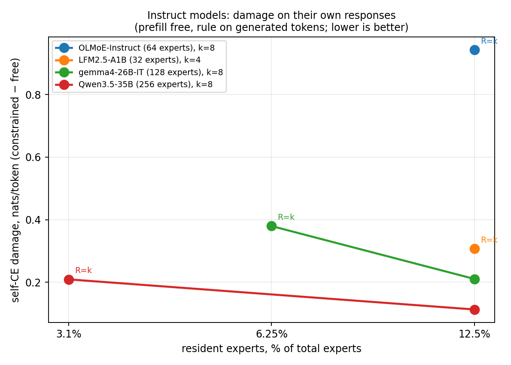

*Self-CE damage against residency fraction, R=k marked. The vertical ordering is the granularity
law on instruct checkpoints; the two-point slopes are the k-to-12.5% recovery.*

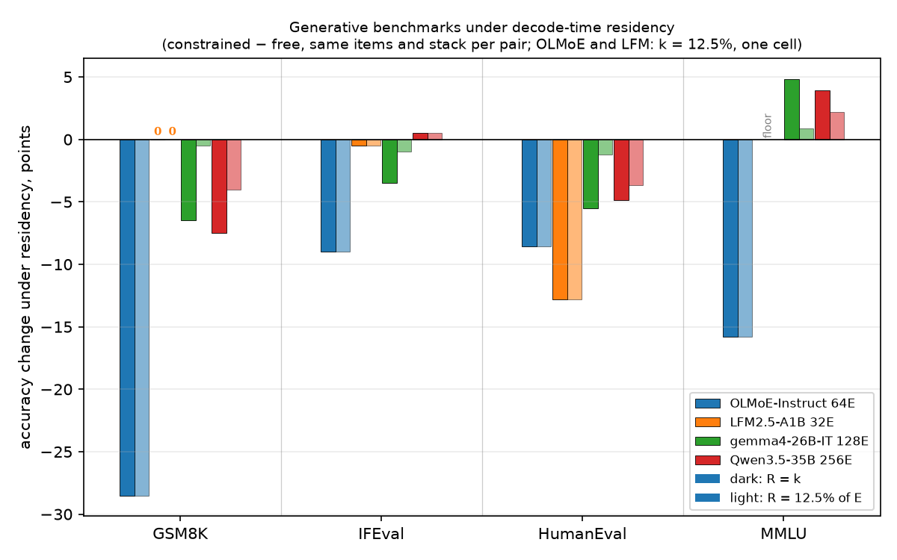

*Per-benchmark accuracy change, dark R=k against light 12.5%. The extra slots pay on GSM8K and
almost nowhere else; OLMoE and LFM pairs are one cell (k = 12.5%).*

- **Prefill seeding is unnecessary for quality.** Cold decode (scan blind to the prompt) matches
  the prompt-warmed protocol within 5e-3 nats on all four models: OLMoE 1.2941 against 1.2967, LFM
  0.7035 against 0.7037, gemma4 0.3498 against 0.3498, qwen3.5 0.3362 against 0.3414
  (`instruct_selfce.csv`, cold rows). The rolling set re-converges
  within a few tokens, so the serving protocol needs no prefill-observation machinery for quality.
- **Task damage is capability-weighted, not uniform.** The lexical-router model loses everywhere
  (OLMoE −22.5 gsm8k, −21.9 mmlu at R=k); the robust models pay mostly on code and math at tight
  residency (LFM humaneval −15.9; qwen −14.6 humaneval at R=k), largely recovered at
  12.5% (qwen humaneval −7.3, gsm8k −1.5).
- **Length does not protect: a correction.** On the corrected protocol with exact token counts,
  the previously reported anti-correlation between response length and damage (+0.72) does not
  replicate: Spearman −0.25 (p = 0.49, n = 10 default-mode cells). The original signal was an
  artifact of budget-truncated short-answer cells and reconstructed lengths
  (`length_damage.py`; superseded claim recorded in 02 §6).

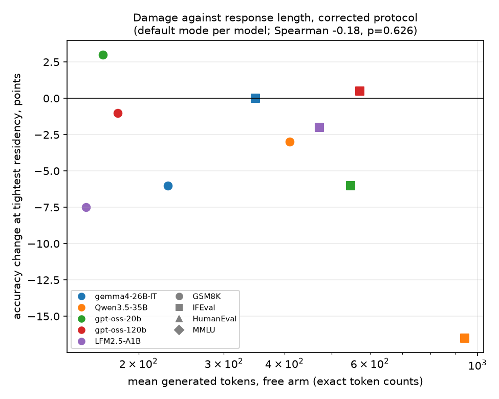

*Damage at the tightest arm against exact mean response length, colour per model, shape per
benchmark. No significant relationship survives the protocol correction.*

### Thinking and the constraint

Every thinking-capable model ran both thinking modes (gemma toggled on, qwen toggled off,
gpt-oss at effort low/medium/high; LFM has no toggle), same arms, items and recipes
(`think_ablation_summary.csv`, `think_analysis.py`):

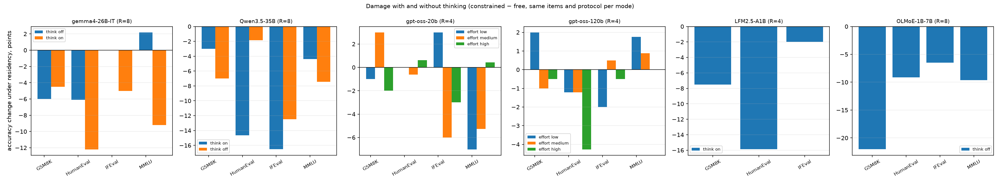

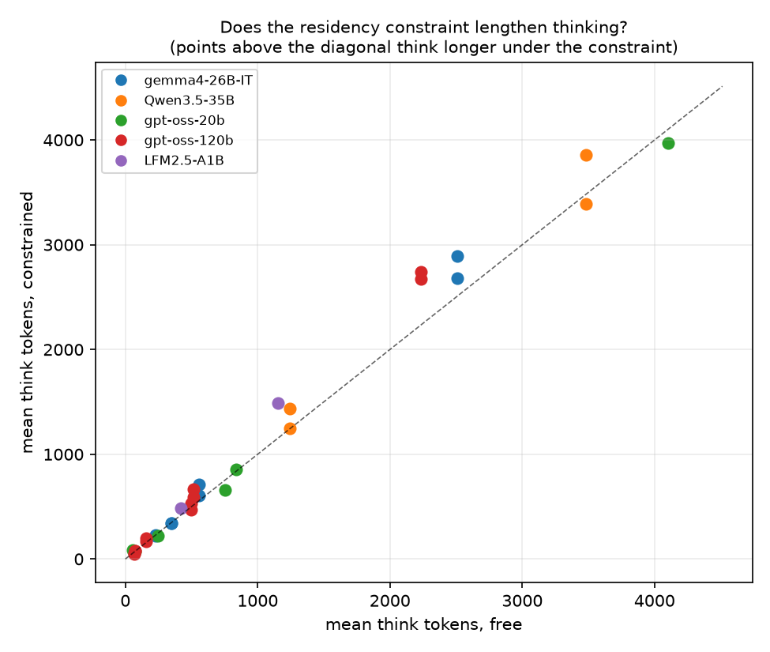

- **Thinking is a tightness-dependent lever, not blanket protection.** At R=k, thinking
  amplifies damage on both paired models (qwen R8, on vs off: ifeval −15.5 vs −12.5, humaneval
  −14.6 vs −3.7; gemma R8: humaneval −12.2 vs −6.1, mmlu −9.2 vs positive); at R=4k the
  on-mode damage shrinks to a few points and beats off-mode on mmlu (+1.3 vs +0.4). More
  effort erases 120b's mmlu damage even at 3% residency.
- **Whether the constraint lengthens generation is model- and task-dependent, not
  universal.** 23 of 38 measured cells lengthen: gemma think-on lengthens strongly
  (gsm8k ×1.28 at R=k, ×1.18 at R=16) and 120b's high-effort ifeval runs ×1.3, but
  qwen *shortens* on gsm8k under the constraint (×0.78 at R=k) and 20b is mixed
  (×0.88–1.04). The earlier claim of a clean tightness-scaled lengthening law was an
  artifact of the retired retry ladder's length capture and is withdrawn
  (`think_ablation_summary.csv`, exact doc-keyed counts).
- **Two real mode costs survive every harness check**: gemma's forced-on thinking writes worse
  code outright (humaneval free 0.99 → 0.84, untruncated, channel-stripped, complete
  functions failing tests) — though it is code-specific: think-on now *beats* think-off on
  gemma's free-arm ifeval (0.925 vs 0.860) and mmlu (0.851 vs 0.605) under the final
  protocol — and high effort still trades instruction compliance for deliberation
  (ifeval free: 20b 0.815 → 0.565, 120b 0.830 → 0.760 medium → high).
- **At high effort, residency damage largely vanishes**: 20b's R=k arm sits within
  ±2.5 points of free on all four benchmarks (+2.5 ifeval to −2.0 gsm8k) and 120b's
  within ±0.5 on gsm8k/mmlu — against material damage at medium effort. The stronger
  earlier claim (constrained beating free across the board) came from ladder-era
  cells and is withdrawn; "more reasoning absorbs the constraint" is the surviving,
  weaker statement.
- **Mode means over the four benchmarks at R=k** (2026-08-16 rerun, single-pass
  protocol, `think_ablation_summary.csv`) put the amplification in one view:
  gemma off −2.5 → on −7.7; qwen off −7.2 → on −9.6; gpt-oss-120b low +0.2 →
  high −1.3; gpt-oss-20b −1.2/−1.0; LFM (on only) −8.5. Free-form thinking
  roughly triples gemma's damage; effort-controlled thinking barely moves.
  Mean think-token ratios at R=k for the on/high modes run 1.13x to 1.24x
  against 0.92 to 0.99 with thinking off — consistent with the cell-level
  picture above (lengthening is real on average for the free-form thinkers,
  and remains task-heterogeneous underneath).
- **Residency fraction, not k, sets the tight-arm difficulty**: qwen's R8 is
  8-of-256 (3.1% resident) and bleeds 7.2 mean points thinking-off where
  gemma's R8 (6.25%) loses 2.5. The adaptation section's fraction-matched
  measurement makes this causal.

**A pretrained instruct model adapts using its own responses and plain cross-entropy.**
*(Era note: the adaptation trio below — base, adapted, control — was measured under the
earlier greedy protocol; the three arms are internally paired and the comparison stands,
but the levels are not comparable to the corrected tables above. See PROTOCOL_ERAS.md.)*
gemma4-26B-IT: attention LoRA r32 + router and norm gains, 3.4M response tokens of its own
vLLM-generated WildChat responses (training prompts disjoint from every evaluation set by
construction), R=8 enforced on response tokens during training, one GPU-hour
(`train_gemma_ce.py`, `gen_traj_vllm.py`; cells in `instruct_genbench_vllm.csv`):

| gemma4-26B-IT under R=8 | GSM8K | IFEval | HumanEval | MMLU |
|---|---|---|---|---|
| base | 0.770 | 0.860 | 0.927 | 0.640 |
| adapted | 0.795 | 0.820 | **0.951** | **0.711** |

- **Mean +2.0 points under the constraint, three of four benchmarks positive**, gains concentrated
  where base damage was largest; adapted MMLU under the constraint passes the model's own free arm
  (0.711 against 0.697). Free-side capability is preserved, largest single move −3.5.
- **Held-out self-CE is the training diagnostic, not the outcome measure**: 0.519 to 0.449.
- **The control — plain self-SFT with the constraint off during training, matched data, surface
  and learning rate (rows `gemma4_ctrl_sft`) — recovers about half the gain**: R=8 mean 0.811
  against adapted 0.819 and base 0.799 (GSM8K 0.785, IFEval 0.825, HumanEval 0.939, MMLU 0.693).
  Most of the benefit is generic self-SFT robustness; the residual for training under the
  constraint is +0.9 points mean, three of four benchmarks, each inside single-task noise.
  *(On the greedy-era surface. The expert-LoRA program below re-ran this control on the
  corrected protocol and found the opposite balance: with the expert tensors trainable, the
  constraint-off control gives nothing and constraint-aware training is the active
  ingredient. The lever the constraint needs lives in the experts, not the attention path.)*

**The corrected-protocol adaptation program (2026-08-16/17) erases most of the constraint.**
Full recipes, the candidate ladder, and every caveat:
[`gemma_adapt_RESULTS.md`](../../../results/ablations/gemma_adapt_RESULTS.md). The committed
gemma recipe (**D12**): plain CE on the model's own think-off responses — 9,173
benchmark-free prompts (real-user, OSS-seeded, or self-generated; 8-gram screened against
all four test sets) — with the **constraint active on response tokens during training**
(prefill free, per-row enforcement), expert-tensor LoRA r16 on the fused 3D expert weights
(`torch._grouped_mm` path) plus attention LoRA r32, a **KL-to-base anchor at weight 0.05**
on precomputed free-routing top-50 logprobs, 3.4M response tokens, lr 3e-5. Authoritative
200-item instrument, damage vs the *unconstrained* base:

| under R8 | GSM8K | IFEval | HumanEval | MMLU (relaxed) |
|---|---|---|---|---|
| gemma4 base | −6.0 | 0.0 | −6.1 | −0.2 |
| gemma4 **D12** | **0.0** | −1.0 | −1.2 | −1.8 |

- **Every setting above is load-bearing, established by ablation**: the KL weight is a
  dial (0 leaves the free arm damaged; 0.1 repairs it and the MMLU cell but costs
  constrained math; 0.05 is the operating point); **more tokens hurt** — 10M with the
  anchor collapses constrained GSM8K by 14 points while 10M without it is roughly neutral,
  so 3.4M stands; **benchmark-lineage data fakes gains by style matching** — an Orca-Math
  lane (GSM8K-train-seeded) produced +8 GSM8K that vanished when removed, hence the
  benchmark-free-by-construction pool rule.
- **The recipe transfers to Qwen3.5-35B-A3B with per-model tuning** (committed config r2:
  truncation-free pool, KL 0.1; accommodations for 70GB of weights on an 80GB card are
  documented in the RESULTS file). At the **fraction-matched R16 arm (6.25% resident,
  gemma's fraction) adapted qwen reaches base-free parity on GSM8K, HumanEval and MMLU**;
  at R8-of-256 (3.1%) every cell holds within −6.0, constrained IFEval being the one
  unfixed metric. A pool x KL 2x2 showed the knobs interact: the KL-0.1 IFEval/MMLU repair
  only materialises on the truncation-free pool, and dropping the longest rows costs 2 to 4
  GSM8K points that only the full-length pool recovers
  (`screening_genbench.csv` qwen35_ce_d12r{,2,3,4,5}; figure `qwen_attrib_square.png`).
- **Training rows must never be truncated**: mid-response cuts teach degenerate early
  endings (7 to 13-token IFEval answers); gates drop over-length rows whole.
- Figures: `d12_adapt_final.png`, `qwen_d12r_adapt.png`.

**Fluency survives both the constraint and the adaptation.** WritingBench (official
queries and critic model run locally; three disjoint 50-query subsets per cell, paired
deltas; `results/ablations/writingbench/cell_stats.csv`): the constraint costs critic
points at R=k in inverse proportion to model size — LFM **−0.31** (paired SD 0.08),
oss-20b −0.17, qwen −0.15, gpt-oss-120b −0.08, gemma −0.07 — against 6-to-12-point
accuracy costs; writing quality is the robust surface. **Adaptation pays no fluency
tax**: D12 sits at-or-above base in every cell (+0.04 at R8), r2 within ±0.06 of base
everywhere. The one fluency symptom of the raw constraint, a rise in 3-gram loops in
base qwen's generations (3.5% → 5.7% of responses at R8), is removed by adaptation.

## 6. What to do with it

- Exempt the deepest MoE layers if you exempt any. Section 4's endpoint result and section 5's
  corrected profile agree on the last layer; the first is cheap on the pretrained model.
- Pick free sets from single-layer damage measured under the model's own gate convention. The
  published contrary advice was measured under a broken one.
- Do not invest in a better demand oracle. A perfect one is worse at fine granularity.
- Spend effort on smoothing the demand estimate, worth 2.8 times, before eviction policy, worth 2.
- If you serve a residency-constrained instruct model, adapt it first: one GPU-day of
  constraint-aware CE with a KL anchor removes most of the tight-arm penalty (section 5's
  D12 table), costs no fluency, and the recipe transfers across model families with
  per-model tuning of the anchor weight and pool.
- Quote constraint costs at matched residency *fractions*, not matched k. R8 means 6.25% on
  gemma and 3.1% on qwen; cross-model claims at "R=k" conflate two different problems.
- Turn free-form thinking off (or use effort control) when serving tight residency: thinking
  roughly triples gemma's damage at R=k and buys nothing back in the longer chains it writes.

## 7. How much of this to believe

- Every locus and lens measurement is one training seed per cell.
- Only one full MoE run has a preserved router log, so every regime contrast in section 3, and the
  inventory and consistency comparisons in sections 2 and 3, rest on a single baseline.
- No per-layer measurement above 13 layers on models we trained. Section 5's 16-layer evidence comes
  from a model we did not train; its depth profile now replicates at 48, 40 and 30 layers on three
  further external models (`perlayer_qwen3.csv`, `perlayer_qwen3_5.csv`, `perlayer_gemma4.csv`; the
  cross-model program's record is `results/ablations/sweep_RESULTS.md`).
- Eight files cannot be regenerated. Section 3's oracle result rests entirely on two of them and its
  block-wise result on a third, and section 4's cross-regime table on two more.
- Two structural files were measured by a method since superseded but remain the only record of eight
  runs whose checkpoints no longer exist. Section 2's numbers come from the per-layer replacements.
- Four analyses were read and produced nothing load-bearing: momentum smoothing moves set coverage by
  one point across its whole range, anomaly prediction splits by regime exactly as demand
  forecastability does, and a centre-of-mass replay covers two runs of one router variant.

## 8. What is worth doing next

- Does demand forecastability predict which layers are worth *freeing*, cross-model? Section 4
  correlates it with solo cost on our models; section 5 shows solo damage ranks freeing correctly on
  OLMoE. The forecastability correlate has never been measured on any adapted model.
- Hit rate and damage disagree about where the memory budget should go. Section 1's hit-rate
  profile favours shallow layers; sections 4 and 5's damage profiles favour deep ones. The two come
  from disjoint model sets, trained FLAME against pretrained external, and no model carries both
  measurements. Measure both on one model.
- The 1e19 cross-regime cells are re-runnable and would give the imposition direction a third budget.
- The sham percentages need their producer's definition pinned down before they are quoted again.
- Qwen's constrained IFEval (−6.0 at R8, the one metric no adaptation config fixed):
  compliance-filtering the existing self-generated format lane is the identified lever; no
  benchmark-styled prompts, per the lineage rule.
- Gemma's free-arm MMLU cost (−2.8 under D12): the KL bracket 0.03/0.07 is untested.
- Think-on adaptation needs ≥6k generation caps (35.7% of think responses hit 3072 on the
  d7 pool); the chunked-head trainer removed the memory blocker. Think-on *evaluation* of
  the adapted models has never run — whether adaptation shrinks the constrained thinking
  lengthening is an open mechanistic test of why the recipe works.
