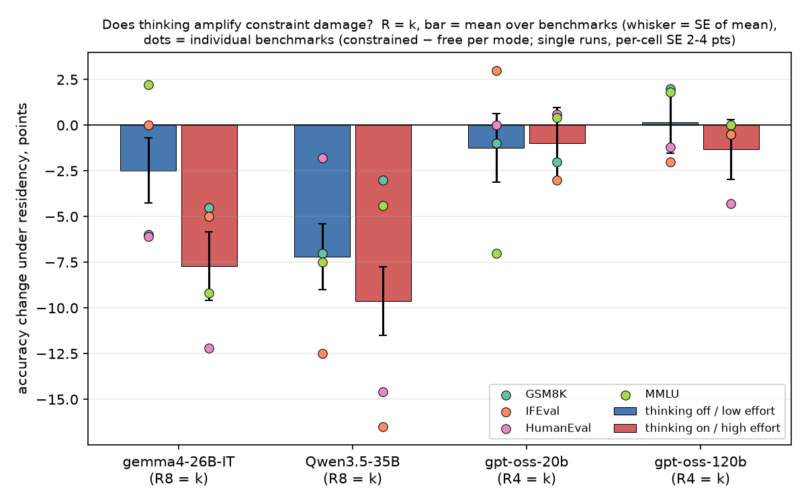
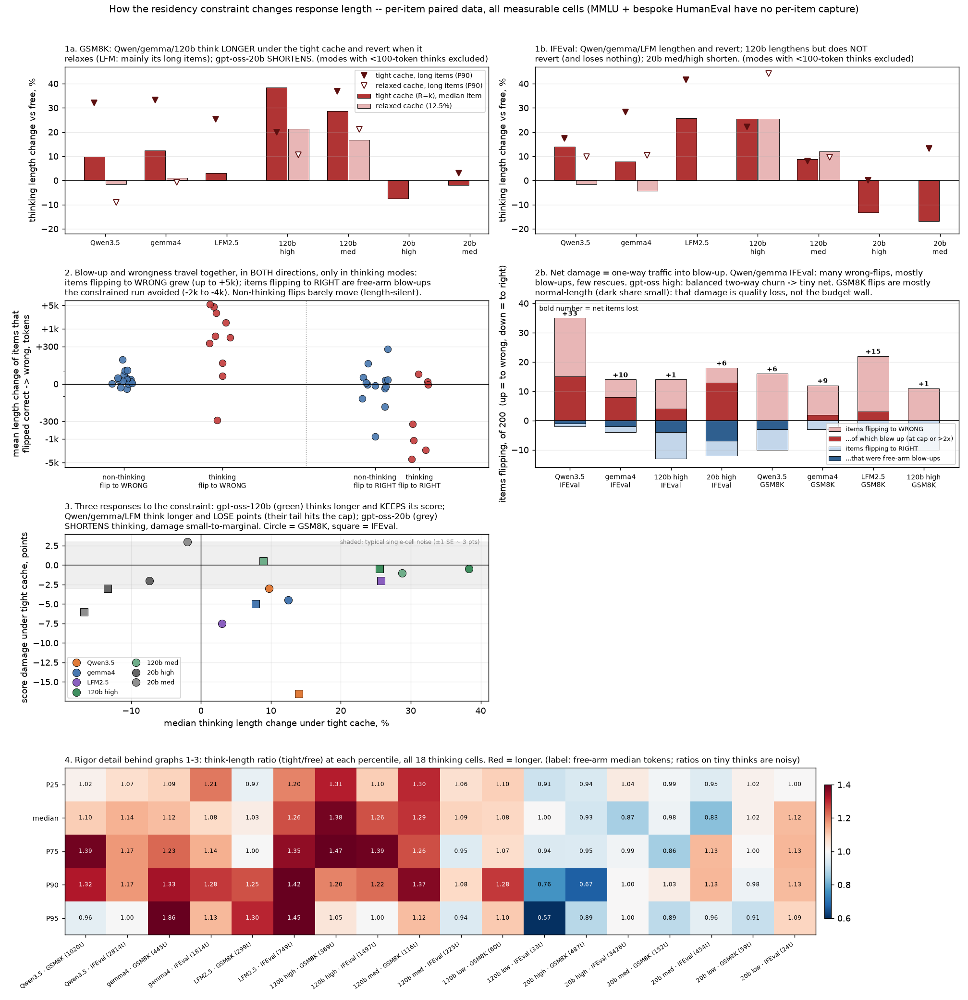
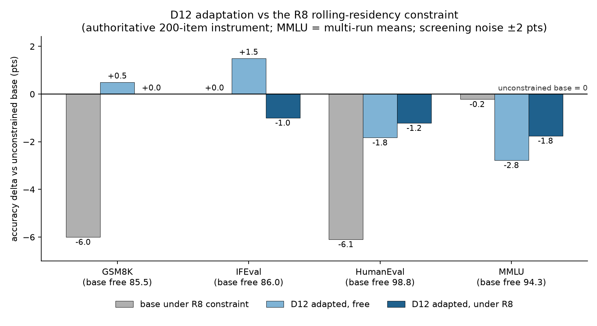
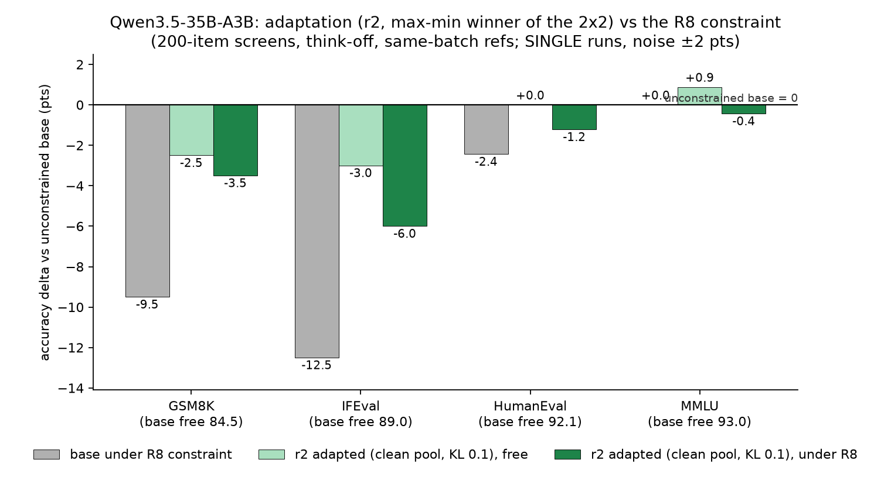
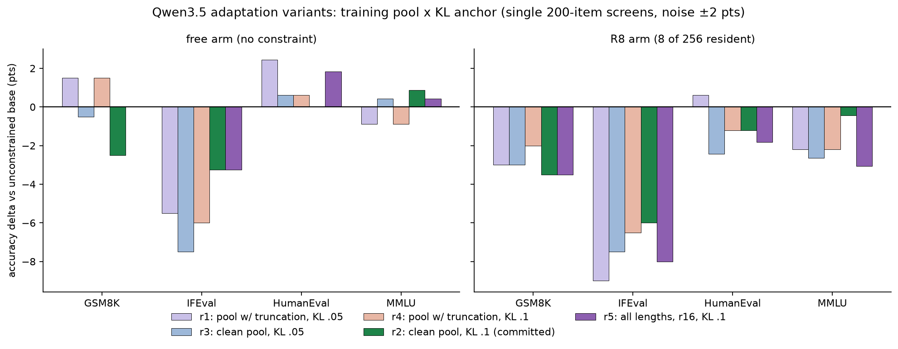

# Instruct MoE under rolling residency: the benchmark grid, thinking, and adaptation

Week of 2026-08-11 to 2026-08-18. Three pieces of work:

- **(a)** re-ran all four benchmarks with proper generation lengths and proper parsing,
  across thinking on/high and off/low, at free, R=k, and R=12.5% arms, for the
  instruct MoE baselines
- **(b)** the length story: how thinking and generation length move under the
  constraint, and what that predicts about damage
- **(c)** adaptation recipes for gemma4-26B-IT and Qwen3.5-35B-A3B

All numbers are accuracy percentage points vs the same model unconstrained
(negative = worse). Authoritative data: `results/ablations/instruct_genbench_vllm.csv`,
`think_ablation_summary.csv`, `screening_genbench.csv`; recipes and ladder detail in
[`gemma_adapt_RESULTS.md`](../../../results/ablations/gemma_adapt_RESULTS.md).

## Setup

- **Rolling residency**: R experts resident per layer, at most **1 swap per generated
  token**, min-logit eviction. Prefill unconstrained; only decode pays.
- **Arms**: `free` (unconstrained), `R=k` (residency = the model's own top-k, the
  tightest servable cache), `R=12.5%` of total experts.
- **Models**: gemma4-26B-IT (k8/E128), Qwen3.5-35B-A3B (k8/E256), gpt-oss-120b/-20b
  (effort low/medium/high), LFM2.5-A1B. **Benchmarks**: GSM8K, IFEval, HumanEval, MMLU.
- **The two measurement fixes that motivated the rerun**:
  - **Proper lengths**: truncate-and-retry ladder retired for single-pass-at-cap;
    caps sized per task (2048 non-thinking, 4096 thinking, 8192 thinking IFEval).
    The ladder had inflated scores **+2.6 points on average** (n=59 paired cells).
  - **Proper parsing**: MMLU dual-scored from the same generations; the strict
    "The answer is (X)" filter measures **few-shot format imitation, not knowledge**.
    Relaxed extraction reported. HumanEval scored channel-aware.

## a) The grid

- Mean damage over the four benchmarks at the tight arm:

  | model | think off / low | think on / high |
  |---|---|---|
  | gemma4-26B-IT (R8 = 6.25%) | **−2.5** | **−7.7** |
  | Qwen3.5-35B (R8 = 3.1%) | **−7.2** | **−9.6** |
  | gpt-oss-120b (R4) | +0.2 | −1.3 |
  | gpt-oss-20b (R4) | −1.2 | −1.0 |
  | LFM2.5-A1B (R4) | no off mode | −8.5 |

- **Relaxing to R=12.5% erases most of it**: gemma +0.8, qwen −2.2, gpt-oss-120b −0.2
  (medium) with thinking off.
- **Residency fraction, not k, sets difficulty**: qwen's R8 is 3.1% of its 256 experts
  and bleeds 7 points where gemma's 6.25% loses 2.5. Section (c) confirms this
  causally at matched fractions.
- Worst single cells live in IFEval and HumanEval (qwen thinking IFEval **−16.5**).
  Per-cell SE 2 to 4 points; single runs.

## b) The length story

Full interactive walkthrough (per-panel, with definitions):
[**The Length Story** artifact](https://claude.ai/code/artifact/1e215a66-00bc-4bb1-a00b-c33dfc48cdeb).
Headline findings:

- **Thinking amplifies constraint damage** where thinking is free-form: gemma
  −2.5 to −7.7, qwen −7.2 to −9.6 when thinking turns on. gpt-oss's
  effort-controlled thinking barely moves (+0.2 to −1.3 across efforts).
- **The constraint makes models think longer, and the extra tokens buy nothing
  back.** Think-token ratio, constrained over free, at R=k: gemma **1.22x**,
  gpt-oss-120b high **1.24x**, gpt-oss-20b low 1.23x, LFM 1.23x, qwen 1.13x.
  Thinking off: **0.92 to 0.99, no lengthening**. Dose-dependent for gpt-oss
  (low 0.95, medium 1.11, high 1.24).

- Whole generations follow suit (gemma thinking on: 1.33x at R=k, 1.16x at 12.5%).
- Reading: the constraint perturbs routing mid-chain; the model backtracks and
  re-derives; chains grow; accuracy still lands below free. **Length is a symptom of
  damage, not a working compensation mechanism.**

## c) Adaptation

### gemma4-26B-IT: constraint cost ~erased (D12)

- **Recipe**: CE on the model's own think-off responses (9,173 benchmark-free
  prompts), **constraint active on response tokens during training**, expert-tensor
  LoRA r16 + attention LoRA r32, **KL-to-base anchor 0.05**, **3.4M tokens**, lr 3e-5.
- **Result at R8** (authoritative, MMLU multi-run means), damage vs unconstrained base:

  | | GSM8K | IFEval | HumanEval | MMLU |
  |---|---|---|---|---|
  | base under R8 | −6.0 | 0.0 | −6.1 | −0.2 |
  | **D12 under R8** | **0.0** | −1.0 | −1.2 | −1.8 |

- The ladder behind those settings:
  - **Constraint-aware training is the active ingredient**: same data, constraint off
    during training, gains vanish.
  - **KL weight is a dial**: 0 leaves the free arm damaged; 0.1 repairs it but costs
    constrained MMLU; **0.05 is the operating point**.
  - **More tokens hurt**: 10M with the anchor collapses constrained GSM8K by 14
    points; 10M without it is neutral. 3.4M stands.
  - **Benchmark lineage is a trap**: an Orca-Math lane (GSM8K-train-seeded) faked
    +8 GSM8K by style-matching. Pools are benchmark-free by construction plus
    8-gram-screened against all four test sets.

### Qwen3.5-35B-A3B: recipe transfers; the tight fraction is the residual

- **Fraction-matched, the gemma result reproduces**: at R16 (6.25% resident, gemma's
  fraction) the adapted model reaches **base-free parity on GSM8K, HumanEval and
  MMLU**. R8-of-256 (3.1%) is structurally harder than anything gemma faced;
  cross-model comparisons should quote matched fractions.
- **Porting cost was real**: 70GB of weights on an 80GB card forced paged 8-bit Adam,
  a chunked-LM-head CE/KL path (never materialises 248k-vocab logits; training
  watermark **81 to 72.8GB**), the plain-HF stack (unsloth's batched constrained
  forward drifts **4.9%** where HF shows 0.0 to 0.3%), and a per-row KL forward.
- **Per-model tuning matters and the knobs interact**: a 2x2 over training pool
  (with vs without truncated rows) x KL weight (0.05 vs 0.1), plus a unification run
  (all lengths, r16 adapters, KL 0.1 = r5):

  - KL 0.1 repairs IFEval and MMLU **only on the truncation-free pool**; dropping
    long rows costs 2 to 4 GSM8K points that only the full-length pool recovers.
  - **r2 (clean pool, KL 0.1) is the committed result**: best worst-cell (−6.0,
    R8 IFEval), free arm at or above base on 3 of 4. Repeat screens reproduced it
    exactly (seeded generation makes same-batch screens deterministic).
  - **r5** (all lengths kept, r16, KL 0.1) owns the free arm (GSM8K 0.0,
    HumanEval +1.8, MMLU +0.4) and most of R16, but gives back R8 IFEval/MMLU;
    documented as the serving choice when the deployment runs at R16.
- **Open**: constrained IFEval is the one metric no qwen config fixes (best −6.0
  at R8). Next lever: compliance-filtering the existing self-generated format lane;
  no new benchmark-styled prompts, per the lineage rule.

## Pointers

- Grid + lengths: `instruct_genbench_vllm.csv` (authoritative),
  `think_ablation_summary.csv`, per-item dumps in `genbench_samples/`.
- Adaptation: `screening_genbench.csv` (relative screens, same-batch base refs only),
  `gemma_adapt_RESULTS.md`, adapters in `/workspace/olmoe-adapt/data/`.
- Every figure regenerates from a committed producer in `analysis/residency/`
  (`plot_length_story.py`, `think_tax_plot.py`, `d12_final_figure.py`,
  `qwen_d12r_figure.py`, `qwen_square_figure.py`).
