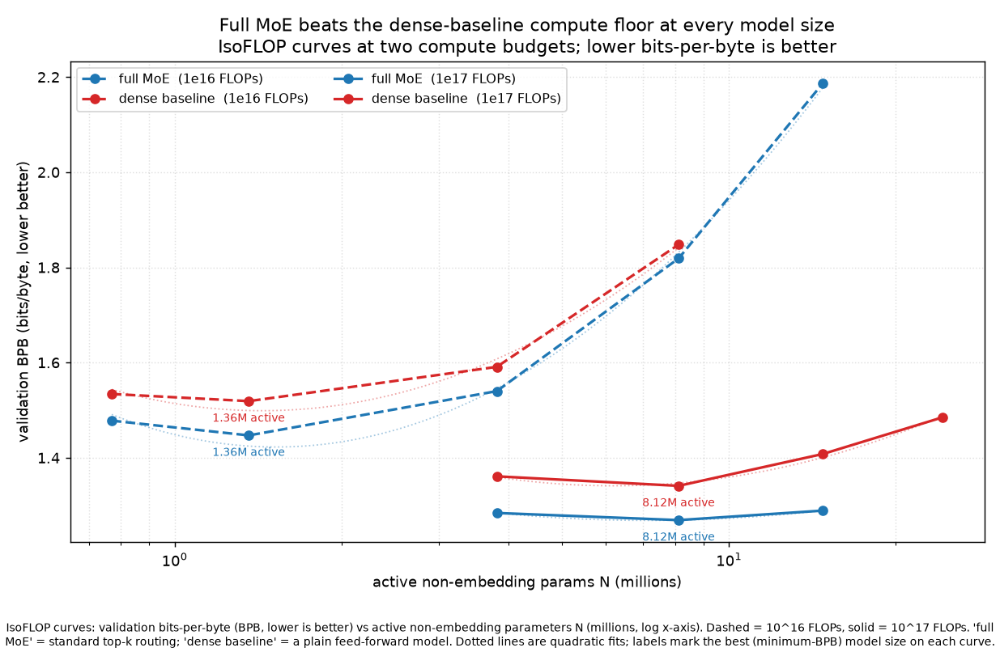

# Phase 0 — Dense IsoFLOP floor (does MoE beat a vanilla dense model of equal active params?)

**Bottom line: yes, at every shape and both budgets.** A sparse FLAME-MoE beats a vanilla dense
(non-MoE) SwiGLU transformer built to spend the *same* FLOPs and carry the *same* active
non-embedding parameter count — by **~0.07 bits-per-byte at the compute-optimal shape** of each
budget, and the gap *widens* as the models grow. This justifies the MoE's routing overhead: the
sparsity buys real quality over a dense model you could have trained instead for the same cost.

## What "dense floor" means here

For each shape we trained a plain dense transformer (no experts, no router, no shared expert) whose
`ffn_hidden_size` is enlarged so its **total non-embedding params == the MoE's *active*
non-embedding params** at that shape. Same token budget, same FLOP target (C = 6·N·D), same locked
HPs (peak-LR 3e-3, warmup 5%, cosine→10%, gb 256, mb 32, bf16, seed 1234), same 16k-BPE + fused-CE.
So the only difference is dense-vs-sparse; the dense run is the honest "what if you spent this
compute on a dense model instead" floor.

Metric is **bits-per-byte (BPB) = CE_nats / (ln2 · bytes_per_token)** (tokenizer-invariant; lower is
better). Dense ffn rounded to even (odd ffn crashes the fused-swiglu JIT warmup). N is active
non-embedding params.

## Measured frontiers (BPB, lower better) — all points measured, see `log.md`

**@1e16:**
| shape | N_active | dense BPB | MoE BPB | MoE − dense |
|---|---|---|---|---|
| sm1 (=s₋₁) | 0.77M | 1.534 | 1.478 | **−0.056** |
| **s0** | 1.36M | **1.519 (min)** | **1.447 (min)** | **−0.072** |
| s1 | 3.81M | 1.591 | 1.540 | −0.051 |
| s2 | 8.12M | 1.848 | 1.819 | −0.029 |

**@1e17:**
| shape | N_active | dense BPB | MoE BPB | MoE − dense |
|---|---|---|---|---|
| s1 | 3.81M | 1.361 | 1.284 | −0.077 |
| **s2** | 8.12M | **1.341 (min)** | **1.269 (min)** | **−0.072** |
| s3 | 14.77M | 1.408 | 1.289 | −0.119 |
| s4 | 24.29M | 1.485 | — | — |

(MoE @1e17 was only swept s1–s3, the parabola bracket; dense added s4 to bracket its own min.)

## Findings

1. **MoE wins everywhere.** MoE − dense is negative at every shared shape (−0.03 to −0.12 BPB). No
   shape exists where the dense floor catches up.
2. **Same compute-optimal shape.** Both the dense and the MoE IsoFLOP parabolas bracket cleanly and
   bottom out at the **same shape** per budget — **s0 (1.36M) @1e16, s2 (8.12M) @1e17** — and the
   optimum shifts right with compute identically for both. So the MoE doesn't just lower the curve,
   it preserves the dense scaling geometry.
3. **The MoE advantage grows with size.** At 1e17 the gap widens s1 → s3 (−0.077 → −0.119): the
   bigger the dense FFN the MoE is replacing, the more the sparse experts help. (At 1e16 the
   right-arm shapes are far past the optimum and badly undertrained, so that arm is noisier.)

## The headline comparison (compute-optimal shape per budget)

| budget | dense floor (best shape) | MoE (best shape) | MoE gain |
|---|---|---|---|
| 1e16 | s0 → 1.519 | s0 → **1.447** | **0.072 BPB** |
| 1e17 | s2 → 1.341 | s2 → **1.269** | **0.072 BPB** |

## Repro

`scripts/phase0/run.sh` with `DENSE=1` (sets the matched even ffn per shape, drops all MoE args),
driven by `drive.sh` over `dense_1e16.txt` / `dense_1e17.txt` (+ `dense_ext_*.txt` left-arm
brackets). Env: `DENSE=1 CE_FUSION=1 TOKENIZER_MODEL=/abs/data/tok16k DATA_DIR=/abs/data/tok16k_full
BPB_DIVISOR=2.7568` (absolute paths required — run.sh `cd`s into Megatron-LM before the tokenizer/data
resolve). Plot: `plot_dense_vs_moe.py`.
