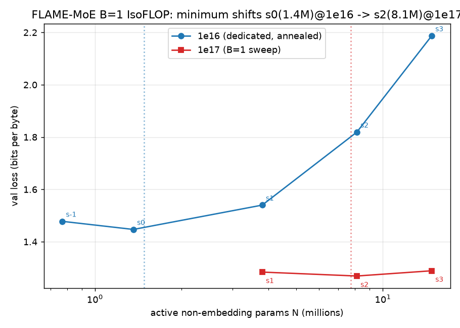

# Phase 0 — FLAME-MoE B=1 baseline results (single RTX A6000)

Establishes & validates stock FLAME-MoE (B=1, s=1) scaling behavior as the reference for the
Temporal-MoE ablation (`docs/research/TEMPORAL_ABLATION_PLAN.md`). All numbers below are **measured**
(logged in `log.md`); none are fabricated.

## Headline

At fixed compute, validation loss vs model size is a **parabola**, and its **minimum shifts right as
the FLOP budget grows** — the compute-optimal model size scales with compute, exactly as the FLAME
scaling law predicts.

| budget | parabola minimum | min loss (BPB) | law-predicted optimal N |
|---|---|---|---|
| 1e16 | **s0 (1.36M active)** | 1.447 | 1.48M |
| 1e17 | **s2 (8.12M active)** | 1.269 | 7.74M |

## Metric: bits-per-byte (BPB), not raw cross-entropy

Because we use a custom **16,000-token BPE** tokenizer (see "Deviations"), raw CE isn't comparable to
the 50k-vocab FLAME law. We report **BPB = CE_nats / (ln2 · bytes_per_token)** (tokenizer-invariant).
bytes/token: bpe-16k = 3.977 (÷2.7568). The FLAME-law CE targets convert to BPB bars:
**≤ 1.645 @1e17, ≤ 2.149 @1e16** (law optima 1.578 / 2.048).

## Locked hyperparameters (all sweep runs)

peak-LR **3e-3**, warmup **5%** of iters (cosine → 10%, min-lr 3e-4), grad-clip 1.0, weight-decay 0.01,
aux-loss 0.01, z-loss 0.001, global-batch 256, micro-batch 32, bf16, seed 1234.
Tuned at s2 (LR sweep @1e16 → confirm @3e16: lr3e-3 beat lr1e-3 at the longer budget), re-validated
stable across the 14× size range (s2/s4/s6 @3e16, no divergence).

## Measured frontiers (val loss, BPB)

**@1e17 (B=1 IsoFLOP, the deliverable parabola):**
| shape | N_active | BPB |
|---|---|---|
| s1 | 3.81M | 1.284 |
| **s2** | 8.12M | **1.269 (min)** |
| s3 | 14.77M | 1.289 |

**@1e16 (dedicated annealed runs, including sub-s1 shapes s0 / s₋₁):**
| shape | N_active | BPB |
|---|---|---|
| s₋₁ | 0.77M | 1.478 |
| **s0** | 1.36M | **1.447 (min)** |
| s1 | 3.81M | 1.540 |
| s2 | 8.12M | 1.819 |
| s3 | 14.77M | 2.187 |

**The (B=1, s=1) temporal reference baselines** (best shape per budget): **1e17 → 1.269 BPB (s2),
1e16 → 1.447 BPB (s0)**.

## Acceptance criteria status

1. **Best-shape ≤ bar — PASS.** @1e17 s2 = 1.269 ≤ 1.645; @1e16 s0 = 1.447 ≤ 2.149. (Real models beat
   the law's pessimistic 1e16 extrapolation by ~0.8 BPB.)
2. **Curve shape — PASS.** @1e17 parabola with min at s2 (within s1–s3); @1e16 parabola with min at s0
   (and monotone-increasing across s1–s6, the plan's original expectation).
3. Reproducibility (2nd seed at min shape, |Δ|≤0.03) — **pending.**
4. Per-expert load (no expert >8× mean, aux converged) — **pending** (`scripts/phase0/expert_load.py`).

## Single-GPU adaptations (vs stock FLAME / the plan) — documented for fidelity

- **EP=1** (vs FLAME's EP=8) + **`--moe-grouped-gemm`** to batch the 64 local experts (numerically
  equivalent to FLAME's per-GPU sequential experts).
- **TransformerEngine impl** (FLAME's native path), TE 1.11 built from the vendored source.
  `--no-gradient-accumulation-fusion` (apex absent; perf-only).
- **head_dim = 16 for every shape** (heads = hidden/16). Fixed 16 heads gave head_dim 12/20/28 for
  s1/s3/s5 → TE fused-attention fell back to a slow path (3× slower); identical params/FLOPs.
- **16k-vocab BPE** instead of the 50k pythia tokenizer + **fused cross-entropy** — 1.69× faster
  (the 50k logits dominated FLOPs at these tiny scales). Reported in BPB to stay comparable.
- micro-batch capped at 32 by the vocab-logits memory.

## Repro

`scripts/phase0/run.sh` (env-parametrized launcher), `drive.sh` (sequential driver),
`shapes.py` (active-param / token-budget calc), `parse_run.py` (BPB parser), `summarize.py`
(frontier + criteria), configs `sweep_*.txt`. Data: dclm-baseline tokenized with the 16k BPE
(`train_tok16k.py` + `fast_tokenize.py`), 5.55B-token corpus.
